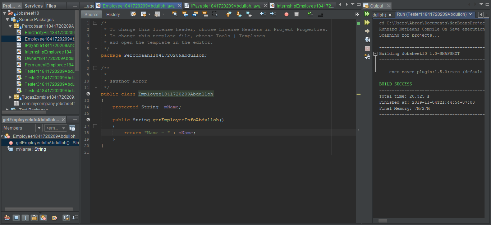
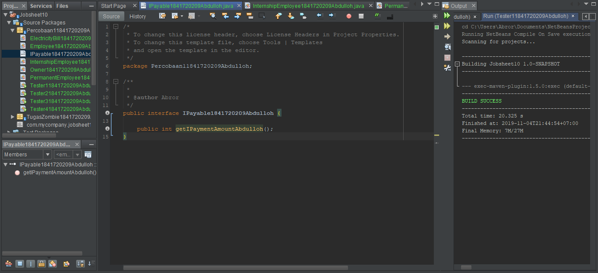
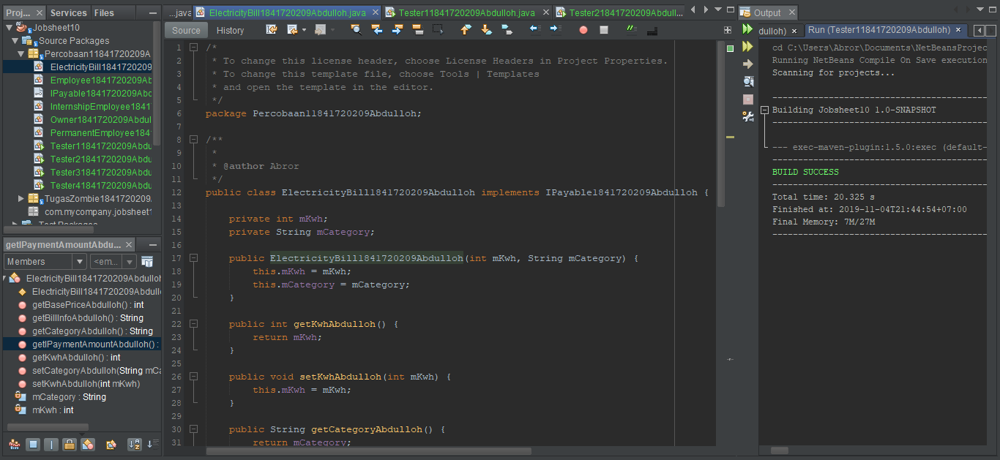
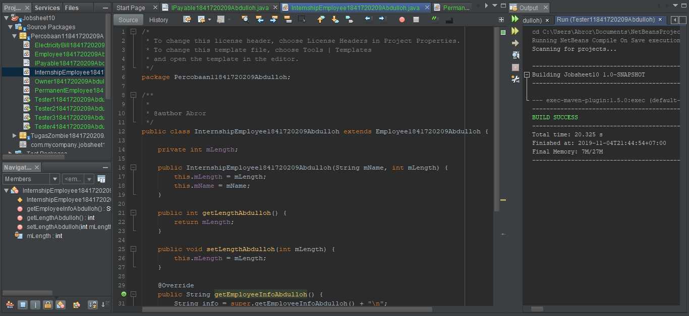
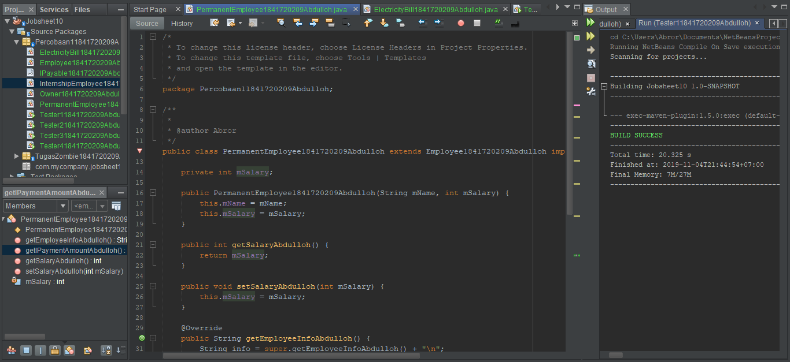
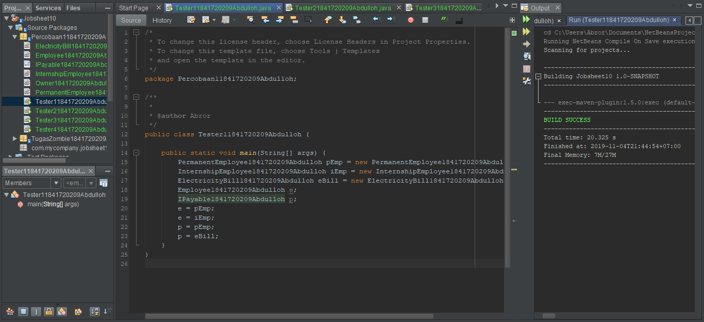
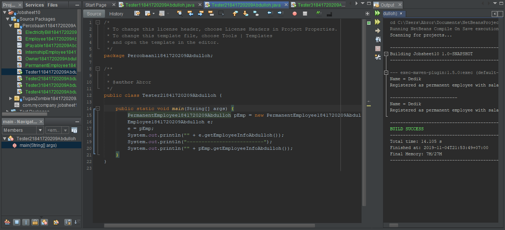
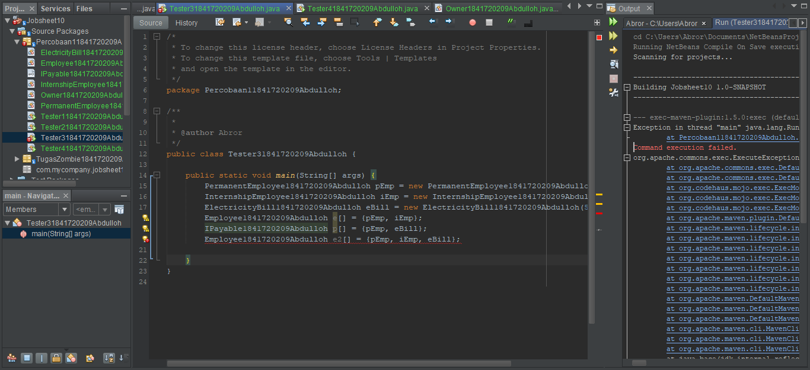
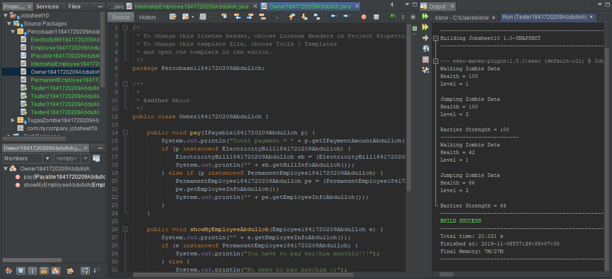
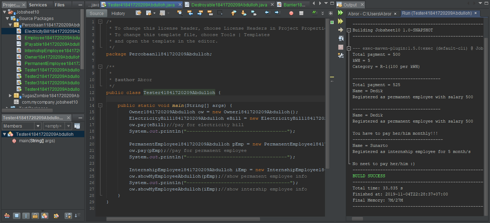

# Laporan Praktikum #10 - Polimorfisme

## Kompetensi

Setelah menyelesaikan lembar kerja ini mahasiswa diharapkan mampu:
- Memahami konsep dan bentuk dasar polimorfisme
- Memahami konsep virtual method invication
- Menerapkan polimorfisme pada pembuatan heterogeneous collection
- Menerapkan polimorfisme pada parameter/argument method
- Menerapkan object casting untuk meng-ubah bentuk objek

## Praktikum 1 – Bentuk dasar polimorfisme

#### Class Employee, IPayable, InternshipEmployee, PermanentEmployee, ElectricityBill, Tester 1

Penjelasan : 

Link kode program : [Link_Employee](../../src/10_Polimorfisme/Employee1841720209Abdulloh.java)

Link kode program : [Link_IPayable](../../src/10_Polimorfisme/IPayable1841720209Abdulloh.java)

Link kode program : [Link_ElectricityBill](../../src/10_Polimorfisme/ElectricityBill1841720209Abdulloh.java)

Link kode program : [Link_InternshipEmployee](../../src/10_Polimorfisme/InternshipEmployee1841720209Abdulloh.java)

Link kode program : [Link_PermanentEmployee](../../src/10_Polimorfisme/PermanentEmployee1841720209Abdulloh.java)

Link kode program : [Link_Tester1](../../src/10_Polimorfisme/Tester11841720209Abdulloh.java)

### Pertanyaan Percobaan 1

1. Class apa sajakah yang merupakan turunan dari class Employee?

Jawab:

> Yang merupakan turunan dari class Employee ialah class InternshipEmployee dan class PermanentEmployee

2. Class apa sajakah yang implements ke interface Payable?

Jawab:

> Yang merupakan implements ke interface Payable adalah class ElectricityBill dan class PermanentEmployee

3. Perhatikan class Tester1, baris ke-10 dan 11. Mengapa e, bisa diisi dengan objek pEmp (merupakan objek dari class PermanentEmployee) dan objek iEmp (merupakan objek dari class InternshipEmploye) ?

Jawab:

> Karena e merupakan deklarasi dari class Employee yang mempunyai subclass permanentEmployee yang berobjek (pEmp) dan IntershipEmployee yang berobjek (iEmp), maka dari itu e bisa memanggil kedua-nya

4. Perhatikan class Tester1, baris ke-12 dan 13. Mengapa p, bisa diisi dengan objek pEmp (merupakan objek dari class PermanentEmployee) dan objek eBill (merupakan objek dari class ElectricityBill) ?

Jawab:

> Karena p merupakan deklarasi dari class Payable dan class permanentEmployee yang berobjek (pEmp) dan ElectricityBill yang berobjek (eBill) class yang mengimplements dari class Payable, maka dari itu p bisa memanggil kedua-nya

5. Coba tambahkan sintaks:
    
    p = iEmp;

    e = eBill;
    
    pada baris 14 dan 15 (baris terakhir dalam method main) ! Apa yang menyebabkan error?

Jawab:
> Karena IntershipEmployee bukan merupakan turunan dari class Payable, dan ElectricityBill juga bukan turunan dari class Employee

6. Ambil kesimpulan tentang konsep/bentuk dasar polimorfisme!

Jawab:

>Kesimpulannya ialah Polimorfisme adalah kemampuan suatu objek untuk mengungkapkan banyak hal melalui satu cara yang sama.
Polimorfisme mengizinkan kelas induk untuk mendefinisikan sebuah method general (bersifat umum) untuk semua kelas turunanya, dan selanjutnya kelas-kelas turunan dapat memperbaharui implementasi dari method tersebut secara lebih spesifik sesuai dengan karakteristiknya masing-masing.

## Praktikum 2 – Virtual method invocation

#### Class Tester 2

Penjelasan : 

Link kode program : [Link_Tester2](../../src/10_Polimorfisme/Tester21841720209Abdulloh.java)

### Pertanyaan Percobaan 2

1. Perhatikan class Tester2 di atas, mengapa pemanggilan e.getEmployeeInfo() pada baris 8 dan pEmp.getEmployeeInfo() pada baris 10 menghasilkan hasil sama?

Jawab:

> Karena pada baris ke 7 sudah dideklarasikan bahwa object e merupakan pEmp.

2. Mengapa pemanggilan method e.getEmployeeInfo() disebut sebagai pemanggilan method virtual (virtual method invication),sedangkan pEmp.getEmployeeInfo() tidak?

Jawab:

> Karena e memanggil method overriding dari class permanentEmployee, maka saat itu terjadi pemanggilan method virtual

3. Jadi apakah yang dimaksud dari virtual method invocation? Mengapa disebut virtual?

Jawab:

> Virtual Method Invocation bisa terjadi jika terjadi polimorfisme dan Overriding. Pada saat obyek yang sudah dibuat tersebut memanggil overridden method pada parent class, kompiler Java akan melakukan invocation (pemanggilan) terhadap Overriding method pada subclass, dimana yang seharusnya dipanggil adalah overridden method.

## Praktikum 3 – Heterogenous Collection

#### Class Tester 3

Penjelasan : 

Link kode program : [Link_Tester3](../../src/10_Polimorfisme/Tester31841720209Abdulloh.java)

### Pertanyaan Percobaan 3

1. Perhatikan array e pada baris ke-8, mengapa ia bisa diisi dengan objek-objek dengan tipe yang berbeda, yaitu objek pEmp (objek dari PermanentEmployee) dan objek iEmp (objek dari InternshipEmployee) ?

Jawab: 

> Karena objek pEmp dan iEmp merupakan object dari class yang merupakan turunan dari class Employee

2. Perhatikan juga baris ke-9, mengapa array p juga biisi dengan objekobjek dengan tipe yang berbeda, yaitu objek pEmp (objek dari PermanentEmployee) dan objek eBill (objek dari ElectricityBilling) ?

Jawab:

> Karena objek pEmp dan eBill merupakan object dari class yang mengimplements dari class Payable

3. Perhatikan baris ke-10, mengapa terjadi error?

Jawab:

> Karena eBill bukan termasuk Class turunan dari Class Employee

##  Percobaan 4 – Argumen polimorfisme, instanceod dan casting objek

Link kode program : [Link_Tester3](../../src/10_Polimorfisme/Tester31841720209Abdulloh.java)

Link kode program : [Link_Tester4](../../src/10_Polimorfisme/Tester41841720209Abdulloh.java)

### Pertanyaan Percobaan 4
1. Perhatikan class Tester4 baris ke-7 dan baris ke-11, mengapa pemanggilan ow.pay(eBill) dan ow.pay(pEmp) bisa dilakukan, padahal jika diperhatikan method pay() yang ada di dalam class Owner memiliki argument/parameter bertipe Payable? Jika diperhatikan eBill merupakan objek dari ElectricityBill dan pEmp merupakan objek dari PermanentEmployee?

Jawab:

> Karena keduanya sama - sama mengimplementasikan interface Payable

2. Jadi apakah tujuan membuat argument bertipe Payable pada
method pay() yang ada di dalam class Owner?

Jawab:
> Agar bisa memanggil method getPaymentAmount yang ada di masing – masing object

3. Coba pada baris terakhir method main() yang ada di dalam class Tester4 ditambahkan perintah ow.pay(iEmp); mengapa terjadi error?

Jawab:
> Terjadi error karena iEmp tidak mengimplements class Payable

4. Perhatikan class Owner, diperlukan untuk apakah sintaks p
instanceof ElectricityBill pada baris ke-6 ?

Jawab:
> Untuk mengecek apakah object yang dimasukkan sebagai implements dari Payable atau tidak

5. Perhatikan kembali class Owner baris ke-7, untuk apakah casting objek disana (ElectricityBill eb = (ElectricityBill) p diperlukan ? Mengapa objek p yang bertipe Payable harus di-casting ke dalam objek eb yang bertipe ElectricityBill ?

Jawab:
> Untuk dikembalikan ke instansiasi sesungguhnya sehingga dapat memanggil method getBillInfo() yang hanya ada di class ElectricityBill

## TUGAS

## Kesimpulan

* Perkenalan dan percobaan Abstract dan Interface
* Mengerti lebih tentang implmentasi

## Pernyataan Diri

Saya menyatakan isi tugas, kode program, dan laporan praktikum ini dibuat oleh saya sendiri. Saya tidak melakukan plagiasi, kecurangan, menyalin/menggandakan milik orang lain.

Jika saya melakukan plagiasi, kecurangan, atau melanggar hak kekayaan intelektual, saya siap untuk mendapat sanksi atau hukuman sesuai peraturan perundang-undangan yang berlaku.

Ttd,

***(Abdulloh)***