# Laporan Praktikum #11 - GUI  (Graphical User Interface)

## Kompetensi

Setelah menyelesaikan lembar kerja ini mahasiswa diharapkan mampu:
1. Membuat aplikasi Graphical User Interface sederhana dengan bahasa pemrograman java;
2. Mengenal komponen GUI seperti frame, label, textfield, combobox, radiobutton, checkbox, textarea, menu, serta table;
3. Menambahkan event handling pada aplikasi GUI.

## Percobaan 1: JFrame HelloGUI

Penjelasan : Di percobaan ini untuk membuat aplikasi Java berbasis GUI, kita butuh sebuah frame atau applet untuk media eksekusi aplikasi GUI. Pada Java sebuah frame dapat diwakili oleh sebuah kelas, yaitu JFrame. Melalui kelas JFrame kita bisa mendesain tampilan Java GUI sesuai kebutuhan. Beberapa method yang penting dan sering dipakai yaitu:

1. setSize() : menentukan ukuran frame
2. setLocation() : menentukan lokasi frame pada bagian pojok kiri atas
3. setVisible() : menampilkan frame
4. setDefaultCloseOperation() : menentukan operasi ketika frame ditutup
5. setLocationRelativeTo() : menentukan lokasi frame relatif terhadap parameter komponen yang diinputkan
6. Pack() : menentukan secara otomatis ukuran frame sesuai komponen yang dimasukkan

Jadi:

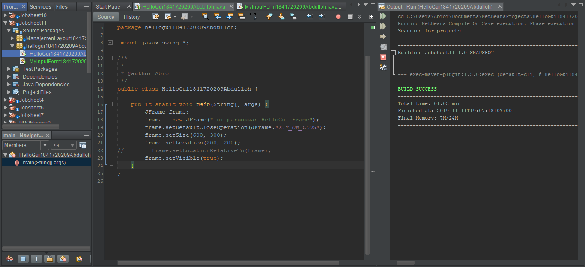

Link kode program : [Link_HelloGUI](../../src/11_GUI/HelloGui1841720209Abdulloh.java)

Hasil:

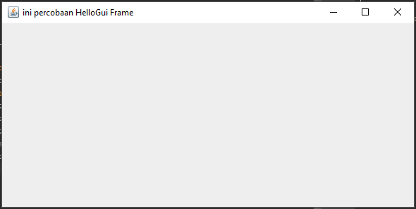

## Percobaan 2: Menangani Input Pada GUI

Penjelasan : Di Percobaan selanjutnya adalah bagaimana memanfaatkan komponen-komponen GUI pada Java untuk menangani inputan, dengan memanfaatkan JFrame, JButton, JLabel, JTextField, JPanel dsb

Jadi:

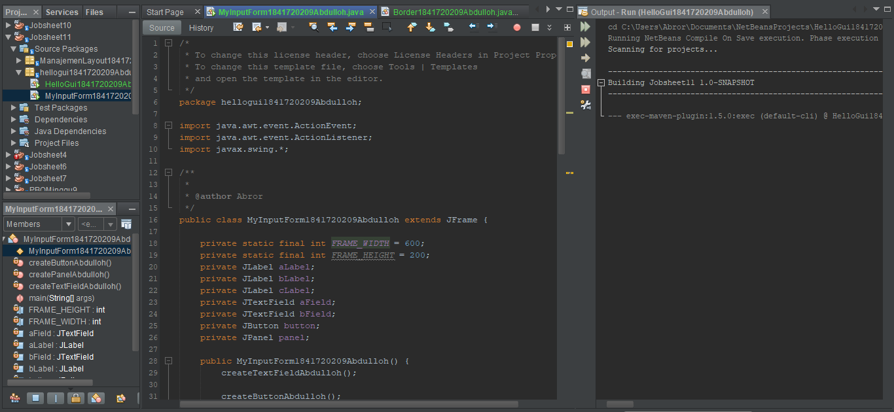

Link kode program : [Link_MyInputForm](../../src/11_GUI/MyInputForm1841720209Abdulloh.java)

Hasil:

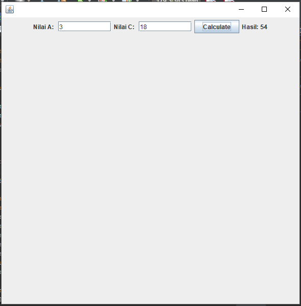

### Pertanyaan Percobaan 2

1. Modifikasi kode program dengan menambahkan JButton baru untuk melakukan fungsi perhitungan penambahan, sehingga ketika button di klik (event click) maka akan menampilkan hasil penambahan dari nilai A dan B

Jawab:
Ada penambahan JButton baru untuk melakukan fungsi perhitungan dan penambahan, sehingga ketika button di klik maka akan menampilkan hasil penambahan dari nilai A dan B

Link kode program : [Link_ModifikasiMyInputForm](../../src/11_GUI/ModifikasiMyInputForm1841720209Abdulloh.java)

Hasil:

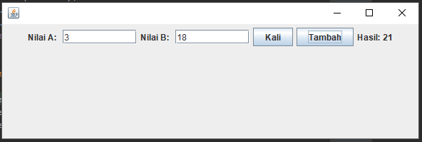

## Percobaan 3: Manajemen Layout

Penjelasan : Java GUI menyediakan beberapa layout yang dapat digunakan pada program. Pada modul praktikum ini akan dijelaskan 3 contoh GUI layout, yaitu:
1. Border layout
2. Grid layout
3. Box layout

Sebuah layout border dapat diilustrasikan pada Gambar dibawah, di mana kita dapat meletakkan komponen GUI pada lokasi tertentu misal utara, barat, tengah, timur, dan selatan. Untuk menentukan jenis layout yang akan digunakan, kita dapat memanggil method setLayout() dan selanjutnya memasukkan objek Border Layout.

Jadi:

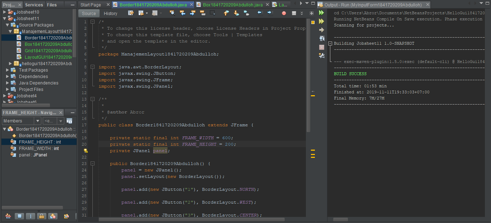

Link kode program : [Link_Border](../../src/11_GUI/Border1841720209Abdulloh.java)

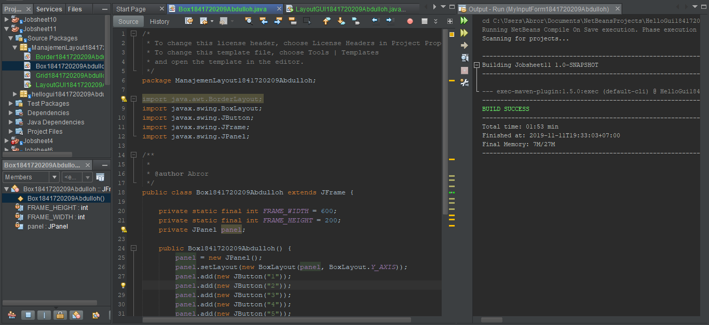

Link kode program : [Link_Box](../../src/11_GUI/Box1841720209Abdulloh.java)

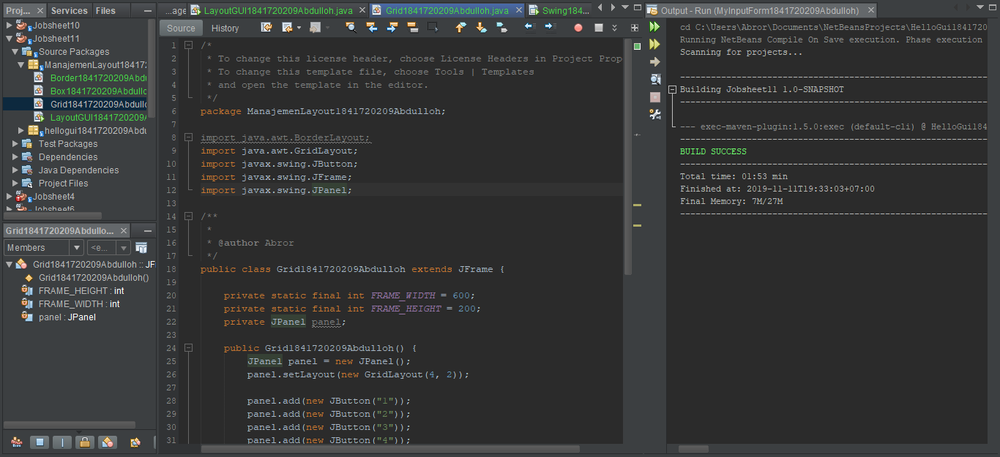

Link kode program : [Link_Grid](../../src/11_GUI/Grid1841720209Abdulloh.java)

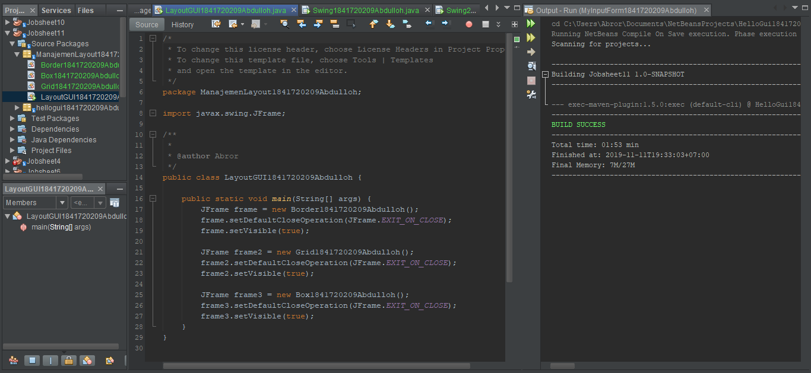

Link kode program : [Link_LayoutGUI](../../src/11_GUI/LayoutGUI1841720209Abdulloh.java)

Hasil:

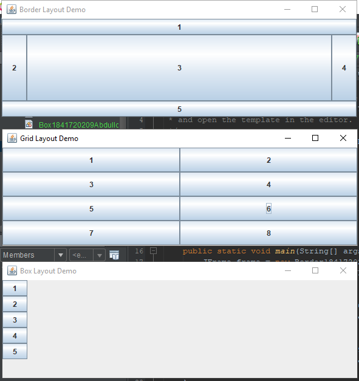

### Pertanyaan Percobaan 3
1. Apa perbedaan dari Grid Layout, Box Layout dan Border Layout?

Jawab:

Grid : Penempatan komponen dalam bentuk “rectangular grid” dan berdasarkan jumlah baris dan kolom yang diinginkan.

Box : Penempatan komponen dalam satu baris atau satu kolom.

Border : Penyusun komponen berdasarkan lokasi geografis: NORTH,SOUTH, EAST, WEST, and CENTER.

2. Apakah fungsi dari masing-masing kode berikut?

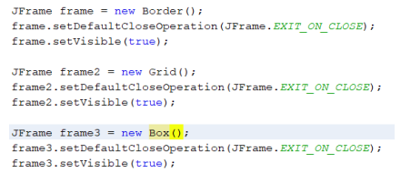

Jawab:

Yang atas digunakan untuk mendeklarasikan objek dari class JFrame dan memberi nama objek frame yang dibuat dengan nama frame, frame2, frame3. yang tengah ketika kita menekan tombol close maka kita akan keluar dari program. yang bawah untuk menampilkan frame dimana setVisible merupakan bentuk dari Boolean yang merupakan salah satu macam type data dalam java yang digunakan untuk menampilkan pilihan true or false.

##  Percobaan 4: Membuat GUI Melalui IDE Netbeans

Penjelasan : Swing merupakan Jendela pada pemrograman Swing yang dapat kita buat dengan Class JFrame

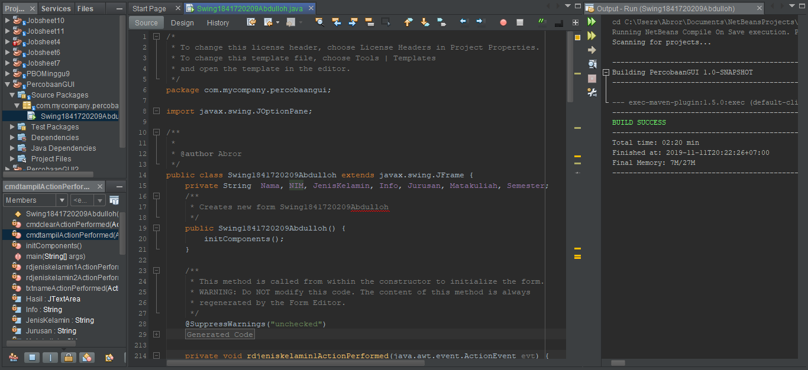

Link kode program : [Link_Swing](../../src/10_Polimorfisme/Swing1841720209Abdulloh.java)

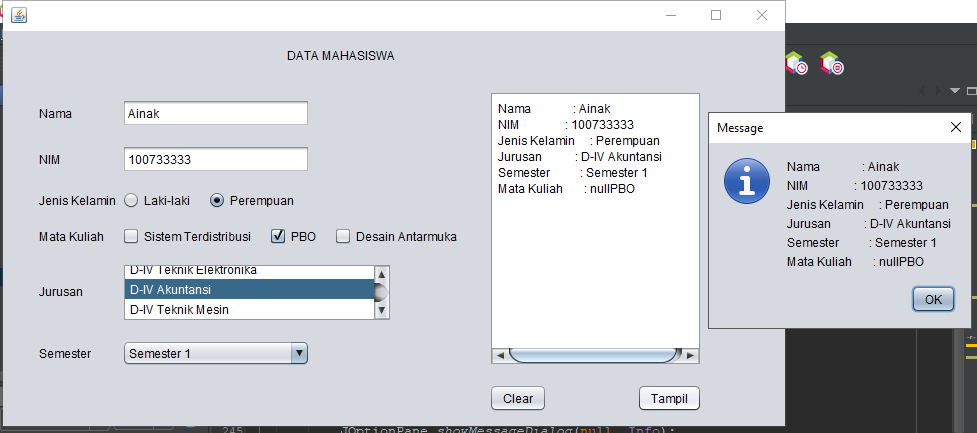

### Pertanyaan Percobaan 4

1. Apakah fungsi dari kode berikut?

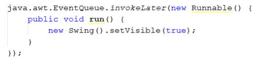

Jawab:

Fungsinya untuk menampilkan JFrame Form

2. Mengapa pada bagian logika checkbox dan radio button digunakan multiple if ?

Jawab:

Agar pengguna tidak dapat memilih keduanya dan untuk melakukan pengecekan checkbox apakah sudah di checklist

3. Lakukan modifikasi pada program untuk melakukan menambahkan inputan berupa alamat dan berikan fungsi pemeriksaan pada nilai Alamat tersebut jika belum diisi dengan menampilkan pesan peringatan

Jawab:

Penjelasan: Ada tambahan seperti berikut

    mAlamat = alamat.getText();
    
    mInfo+="Alamat       : "+mAlamat+ "\n";
    
    JOptionPane.showMessageDialog(null, "Harap isi Alamat", "Isi dengan benar", JOptionPane.WARNING_MESSAGE);

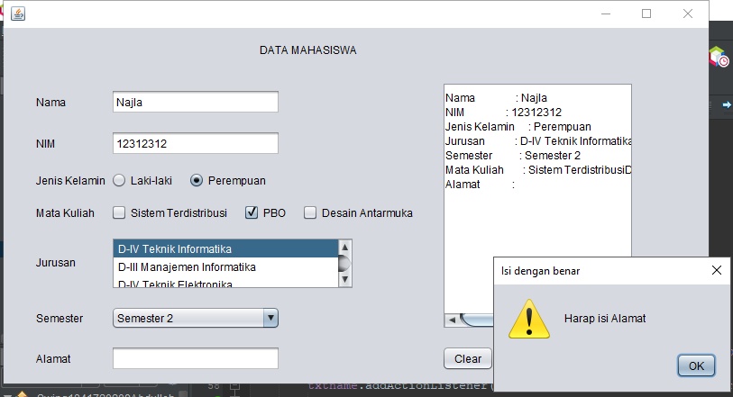

Hasil: [Link_ModifikasiSwing](../../src/11_GUI/ModifikasiSwing1841720209Abdulloh.java)

##  Percobaan 5: JTabPane, JTtree, JTable

Penjelasan : Perkenalan penggunaan JTabPane, JTtree, JTable

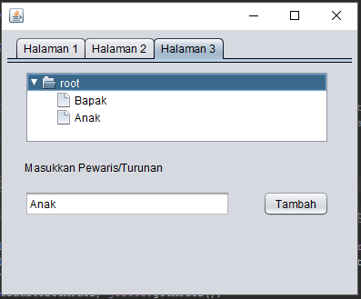

Link kode program : [Link_Swing2](../../src/10_Polimorfisme/Swing21841720209Abdulloh.java)

### Pertanyaan Percobaan 5
1. Apa kegunaan komponen swing JTabPane, JTtree, pada percobaan 5?

Jawab:

JTree merupakan komponen yang digunakan untuk membuat struktur pohon. JTabbedPane merupakan komponen grafis yang digunakan untuk menyusun dan mengelompokkan berbagai komponen Java lain ke dalam lapisan-lapisan (layers). JTabbedPane termasuk kelas-kelas wadah (container classes) yang terletak di paket javax.swing.

2. Modifikasi program untuk menambahkan komponen JTable pada tab Halaman 1 dan tab Halaman 2

Jawab:

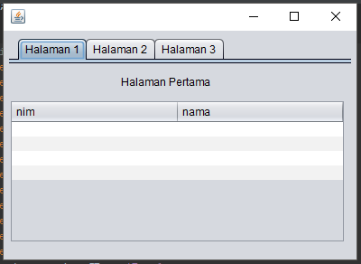

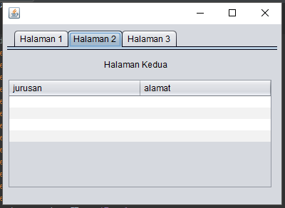

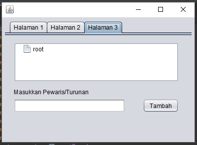

Link kode program : [Link_ModifikasiSwing2](../../src/10_Polimorfisme/ModifikasiSwing21841720209Abdulloh.java)

## TUGAS
Buatlah Sebuah Program yang mempunyai fungsi seperti kalkulator (mampu menjumlahkan, mengurangkan, mengalikan dan membagikan. Dengan tampilan seperti berikut.

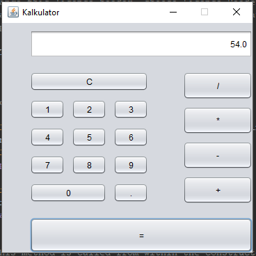

Link kode program : [Link_ModifikasiSwing2](../../src/10_Polimorfisme/Tugas1841720209Abdulloh.java)

## Kesimpulan

* Setelah mempelajari dan mempraktikkan modul ini kita bisa membuat aplikasi Graphical User Interface sederhana dengan bahasa pemrograman java;

* Mengenal komponen GUI seperti frame, label, textfield, combobox,radiobutton, checkbox, textarea, menu, serta table, serta Menambahkan event handling pada aplikasi GUI.

* Keterkaitan GUI sudah sangat jelas dengan penggunaan aplikasi yang kita gunakan sehari-hari dan setelah mempelajari materi ini diharapkan bisa mengaplikasikan dengan baik.

## Pernyataan Diri

Saya menyatakan isi tugas, kode program, dan laporan praktikum ini dibuat oleh saya sendiri. Saya tidak melakukan plagiasi, kecurangan, menyalin/menggandakan milik orang lain.

Jika saya melakukan plagiasi, kecurangan, atau melanggar hak kekayaan intelektual, saya siap untuk mendapat sanksi atau hukuman sesuai peraturan perundang-undangan yang berlaku.

Ttd,

***(Abdulloh)***