# Laporan Praktikum #12 - Collection (List, Set, Map) dan Database

## Kompetensi

Setelah menyelesaikan lembar kerja ini mahasiswa diharapkan mampu:
1. Memahami cara penyimpanan objek menggunakan Collection dan Map.
2. Mengetahui pengelompokan dari Collection.
3. Mengetahui perbedaan dari interface Set, List dan Map.
4. Mengetahui penggunaan class-class dari interface Set, List, dan Map.
5. Memahami koneksi database menggunakan JDBC dan JDBC API

## Rinkasan Materi

Collection adalah sebuah framework yang dibuat untuk menyimpan dan memanipulasi sebuah objek. Collection biasanya digunakan pada sebuah data seperti mencari, meng-urutkan, meng-input dan menghapus. Kerangka kerja (Framework) menyediakan dalam bentuk Interface (contoh : Set, List, Queue, Deque dll). Akan tetapi kita hanya akan membahas Set, List, Map, JDBC APU. Collection terbagi menjadi 4 kelompok yaitu:

1. Set
* Set seperti list tapi setiap element dalam satu set unik. contoh: def namaOrang = [‘Burhan’, ‘Udin’, ‘Burhanudin’, ‘Burhan’] as set
println namaOrang. Jika kalian mencoba code diatas, maka akan menampilkan [Burhan, Udin, Burhanudin]. Pengulangan tidak akan ditampilkan.
* HashSet dapat digunakan untuk menyimpan elemen-elemen bebas-duplikat. Kelas HashSet merupakan suatu kelas konkrit yang mengimplementasikan Set. Pembuatan objek HashSet adalah Set <nama_objek_HashSet> = new HashSet();

2. List
* List digunakan untuk menyimpan sekumpulan objek berdasarkan urutan masuk (ordered) dan menerima duplikat. Dua class penting yang ada dalam Java Collections Framework yang meng-implement List adalah: ArrayList dan LinkedList. 
* ArrayList menyimpan data seperti array (diakses dengan index) namun ukurannya dapat bertambah secara fleksibel.
* LinkedList merupakan implementasi dari algoritma LinkedList yang anda pelajari di Struktur data.

3. Map
* Adalah untuk menyimpan objek pada Map, perlu sepasang objek, yaitu key yang bersifat unik dan terdapat nilai yang disimpan. Class-class yang mengimplementasikan Map adalah Hashtable, HashMap, LinkedHashMap. 
* Pada jobsheet ini yang akan dibahas adalah HashMap. 
* HashMap adalah sebuah class yang berisi sekumpulan pasangan nilai (value) dan kunci (key). Nilai bisa dalam bentuk string, integer, boolean, float, double, objek dan lain sebagainya.
* Contoh pembuatan hashmap adalah HashMap <nama_objek_HashMap> = new HashMap();

4. JDBC API
* JDBC adalah API Java untuk memanipulasi basis data. Dengan JDBC API, para pengembang aplikasi dan applet Java diberi kemudahan untuk mengakses berbagai tipe basis data dari berbagai penyedia basis data (database vendors) seperti MySQL Server, SQL Server, Oracle, Sybase dan sebagainya.
* JDBC merupakan akronim dari Java Database Connectivity
* JDBC merupakan perantara antara Java dengan basis data. JDBC adalah sebuah spesifikasi yang menyediakan sekumpulan interface yang membolehkan akses portabel ke semua basis data.

## Percobaan 1: Set

Penjelasan : Di percobaan yang pertama ini kita memulai dengan membuat package dengan nama identifier.percobaan1, kemudian membuat java class dengan nama DemoHashSet, dan menambahkan source code yang tercantum di jobsheet. Disini kita juga belajar tentang set.

Berdasarkan penjelasan maka jadi:

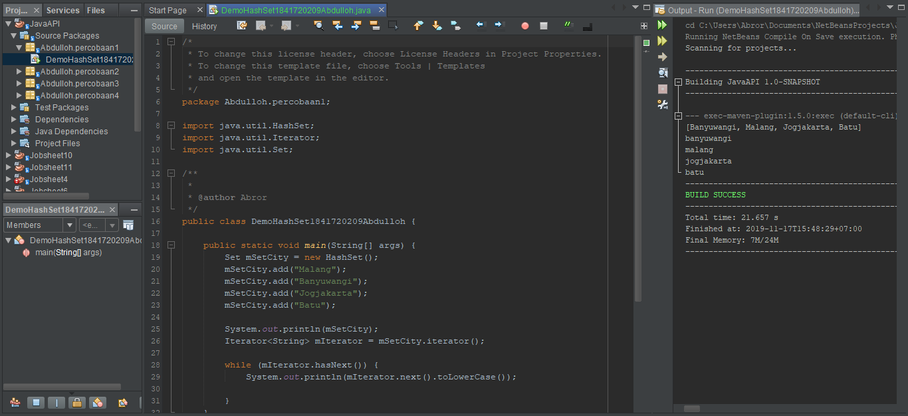

Link kode program : [Link_DemoHashSet](../../src/12_Java_API/Demohashset1841720209Abdulloh.java)

### Pertanyaan Percobaan 1 : Set

1. Apakah fungsi import java.util.*; pada program diatas!

Jawab:

Merupakan perintah program java berisi kelas-kelas yang memperbolehkan program berkomunikasi melewati jaringan dan * sama dengan scanner yang berarti bisa mengimport scanner ke program 

2. Pada baris program keberapakah yang berfungsi untuk menciptakan object HashSet?

Jawab:

Object hashSet terdapat pada baris program ke 19 yang berisikan Set mSetCity = new HashSet();

3. Apakah fungsi potongan program dibawah ini pada percobaan 1!

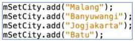

Jawab:

Fungsinya ialah sebagai objek yang akan mengisi suatu data pada index yang harus diisi dan itu merupakan inti dari program yang akan di Set

4. Tambahkan set.add(“Malang”); kemudian jalankan program! Amati hasilnya dan jelaskan mengapa terjadi error!

Jawab:

Hasilnya adalah error karena pada saat melakukan pengisian data membutuhkan objek

5. Jelaskan fungsi potongan program dibawah ini pada percobaan 1!

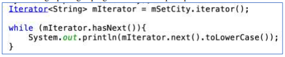

Jawab:

Mendeklarasikan class DemoHashSet, yang mengimplementasi method toLowerCase() untuk mengkonversi string menjadi lower case semua atau menjadi huruf kecil semua. Bila kode program diatas kita eksekusi, keluaran yang dihasilkan akan menjadi huruf kecil semua oleh karenanya dinamakan Lower case.

## Percobaan 2: List

Penjelasan : Tidak jauh beda dengan percobaan 1 tambahkan package dan berikan nama identifier.percobaan2 kemudian mengikuti source code yang tertera pada jobsheet

Jadi:

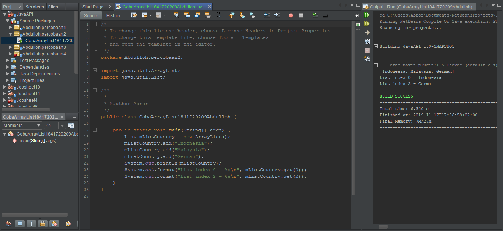

Link kode program : [Link_CobaArrayList](../../src/12_Java_API/CobaArrayList1841720209Abdulloh.java)

### Pertanyaan Percobaan 2

1. Apakah fungsi potongan program dibawah ini!

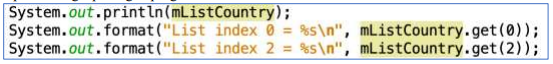

Jawab:

Menampilkan data bertipe string sesuai index array yang di panggil sebagimana yang disuruh hanya Indonesia dan Jerman maka keluarnya sesuai dengan yang disuruh

2. Ganti potongan program pada soal no 1 menjadi sebagai berikut

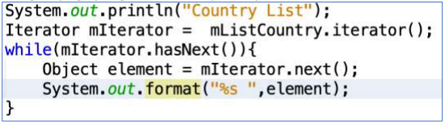

Kemudian jalankan program tersebut!

Jawab:

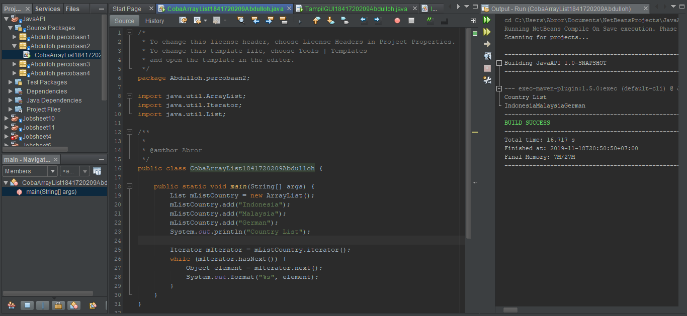

3. Jelaskan perbedaan menampilkan data pada ArrayList menggunakan potongan program pada soal no 1 dan no 2!

Jawab:

Perbedaanya ialah soal no 1 menggunakan input data index array dengan kata lain dipanggil sesuai inputan yang diinginkan, sedangkan soal no 2 menggunakan Array iterasi yang outputnya sesuai dengan input pada index object.

## Percobaan 3 (Map)

Penjelasan : Sama halnya seperti percobaan 1 dan 2 dimulai dengan nama identifier.percobaan3 terus menirukan source coede yang ada pada jobsheet

Alhasil:

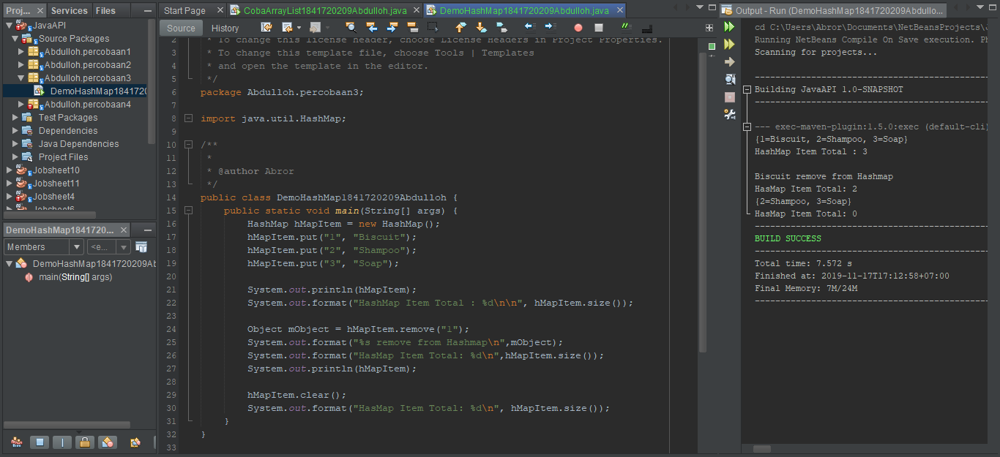

Link kode program : [Link_DemoHasMap](../../src/12_Java_API/DemoHasMap1841720209Abdulloh.java)

### Pertanyaan Percobaan 3
1. Jelaskan fungsi hMapItem.put("1","Biskuit") pada program!

Jawab:

Fungsi hMapItem.put("1","Biskuit") it digunakan untuk mengisi objek pada map dengan pasangan key dan nilai kembali ke materi Key it bersifat unik dan nilai yang disimpan. Untuk mengakses nilai maka kita perlu mengetahui key dari nilai tersebut

2. Jelaskan fungsi hMapItem.size() pada program!

Jawab:

Fungsi hMapItem.size() antara lain untuk mengembalikan int yang berisi jumlah pasangan asosiasi pada map.

3. Jelaskan fungsi hMapItem.remove("1") pada program!

Jawab:

Fungsi hMapItem.remove("1") adalah untuk menghilangkan atau melenyepkan kunci beserta nilai yang dituju

4. Jelaskan fungsi hMapItem.clear() pada program!

Jawab:

Fungsi hMapItem.clear() ialah untuk me-reset atau mengulang semua pasangan asosiasi dalam map

5. Tambahkan kode program yang di blok pada program yang sudah anda buat!

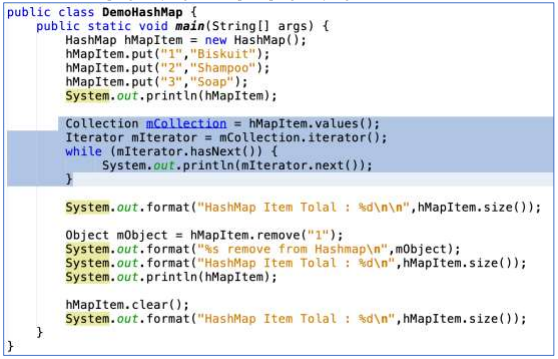

Jawab:

Link kode program : [Link_ModifikasiDemoHashMap](../../src/12_Java_API/ModifikasiDemoHashMap1841720209Abdulloh.java)

6. Jalankan program dan amati apa yang terjadi!

Jawab:

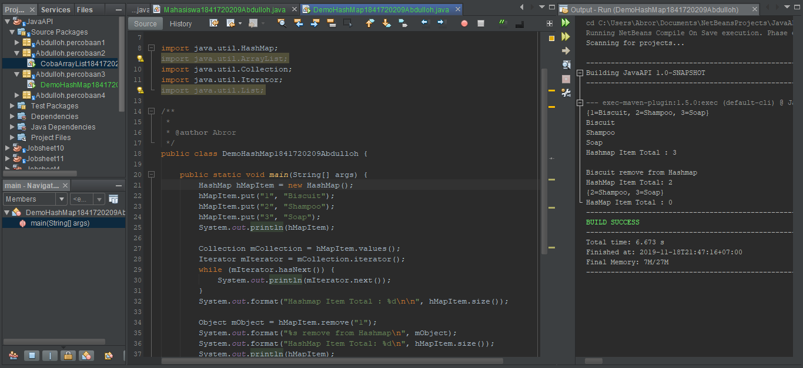

7. Apakah perbedaan program sebelumnya dan setelah ditambahkan kode program pada soal no 5 diatas? Jelaskan!

Jawab:

mIterator digunakan untuk menampilkan element pada collection, dimana mCollection tersebut mengambil nilai dari hMapItem.

##  Percobaan 4: Membuat GUI Melalui IDE Netbeans

Penjelasan : 

Setelah mengikuti step yang ada di jobsheet kita ada sedikit penjelasan yaitu pertama yang perlu kita ingat adalah berbeda dengan array biasa, ArrayList memiliki sejumlah operasi yang lebih lengkap dan mudah digunakan dibandingkan dengan array biasa. Kedua ArrayList merupakan collection yang menjadi bagian dari Java Util. Seperti biasa, ArrayList dapat menambah data baru secara dinamis tanpa harus menentukan ukurannya di awal. Ketiga, Berbagai operasi dapat dilakukan terhadap ArrayList contohnya yang ada pada jobsheet adalah get(), berfungsi untuk mengambil elemen pada indeks tertentu, set(), berfungsi untuk menimpa nilai pada indeks tertentu dan masih banyak lagi.

Jadi:

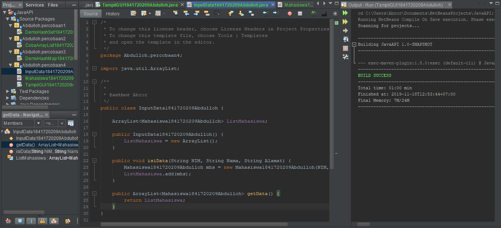

Link kode program : [Link_DemoHasMap](../../src/12_Java_API/InputData1841720209Abdulloh.java)

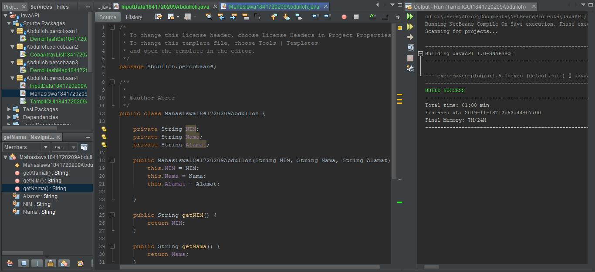

Link kode program : [Link_Mahasiswa](../../src/12_Java_API/Mahasiswa1841720209Abdulloh.java)

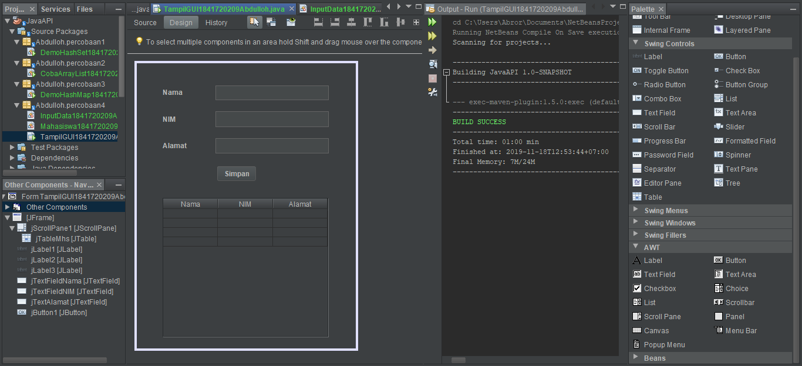

Link kode program : [Link_TampilGUI](../../src/12_Java_API/TampilGUI1841720209Abdulloh.java)

Hasil:

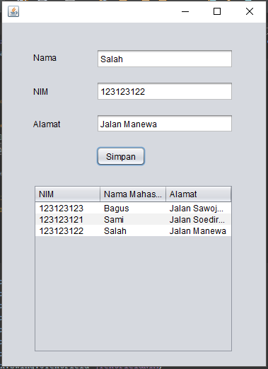

## Percobaan 5 (Aplikasi Biodata)

Penjelasan : Di percobaan terkahir ini kita mencoba membuat jFrame dengan menggunakan basis data MySQL Server dan Xampp dengan mengikuti petunjuuk di jobsheet.

Jadi:

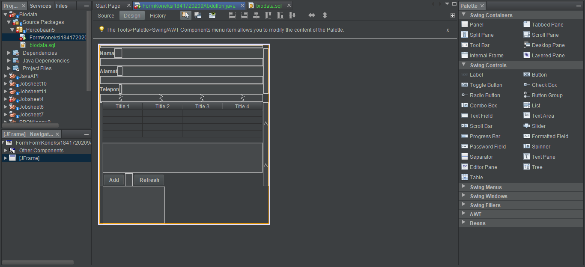

Link kode program : [Link_FormKoneksi](../../src/12_Java_API/FormKoneksi1841720209Abdulloh.java)

### Pertanyaan Percobaan 5
1. Setelah menambah code pada action button klik, coba jalankan program dan tambahkan data. Apakah program berhasil menambahkan data? Jika tidak apakah penyebabnya.

Jawab:

Progam berhasil di tambahkan, Akan tetapu belum bisa menampilkan data penyebabnya adalah belum ada method untuk menampilkan/mengambil data yang sudah di tambahkan

2. Jelaskan maksud source code untuk melakukan insert data diatas?

Jawab:

Maksud source code untuk melakukan insert data diatas untuk menjalankan method buka_koneksi();, lalu menambahkan tipe data String sql yang berisikan perintah untuk menginsertkan data di text field nama, alamat, telepon ke tabel anggota. try catch merupakan sebuah keterangan apabila berhasil(try) dan jika gagal/trejadi kesalahan(catch)

3. Buat Table model yang digunakan untuk memanipulasi tampilan pada Jtable, seperti pada code dibawah ini:

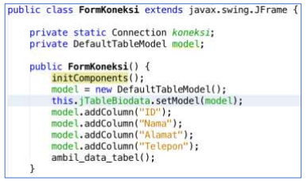

Jawab:

Link kode program : [Link_FormKoneksi](../../src/12_Java_API/FormKoneksi1841720209Abdulloh.java)

4. Selanjutnya buat method ambil_data_tabel seperti berikut:

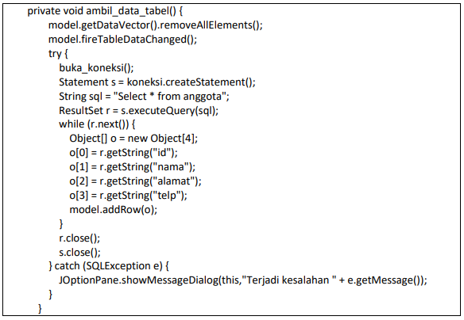

Jawab:

Link kode program : [Link_FormKoneksi](../../src/12_Java_API/FormKoneksi1841720209Abdulloh.java)

5. Jelaskan alur dari method ambil_data_tabel?

Jawab:

Mula-mula menjalankan method model.getDataVector().removeAllElements(); , model.fireTableDataChanged(); lalu mengeksekusi perintah yang ada pada dalam try{}, apabila ada kesalahan / gagal maka yang tereksekusi adalah catch{}

6. Buat fungsi untuk merefresh sehingga data yang baru dapat ditampilkan pada tabel.

Jawab:

Link kode program : [Link_FormKoneksi](../../src/12_Java_API/FormKoneksi1841720209Abdulloh.java)

## Kesimpulan

* Setelah mempelajari dan mempraktikkan modul ini kita bisa membuat dan mengerti apa itu collection di Java yang banyak macamnya diantaranya Set, List, Maps, dan Java Database Connectivity atau JBDC API. Juga mempraktikkan dari JFrame form ke database

* Dengan lebih singkat Set adalah Koleksi yang tidak boleh ada duplikasi nilai, dengan kata lain semua value dari class collection yang mengimplementasikan Set tidak boleh ada duplikasi nilai di dalamnya. Kemudian List digunakan untuk menyimpan sekumpulan objek berdasarkan urutan masuk (ordered) dan menerima duplikat. Map Adalah untuk menyimpan objek pada Map, perlu sepasang objek, yaitu key yang bersifat unik dan nilai yang disimpan. dan JDBC adalah yang tekoneksi pada database.

* Jika menggunakan database dengan netbeans harus menggunakan xampp

## Pernyataan Diri

Saya menyatakan isi tugas, kode program, dan laporan praktikum ini dibuat oleh saya sendiri. Saya tidak melakukan plagiasi, kecurangan, menyalin/menggandakan milik orang lain.

Jika saya melakukan plagiasi, kecurangan, atau melanggar hak kekayaan intelektual, saya siap untuk mendapat sanksi atau hukuman sesuai peraturan perundang-undangan yang berlaku.

Ttd,

***(Abdulloh)***