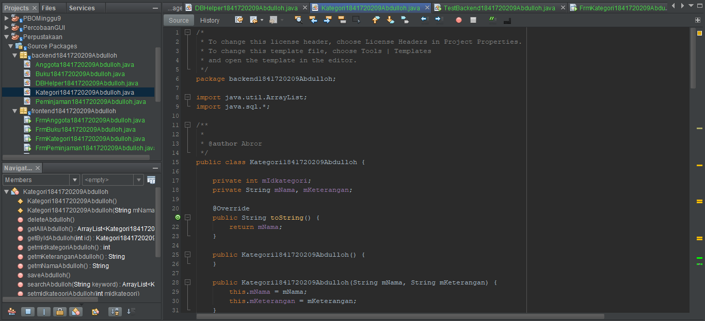

# Laporan Praktikum #14 - GUI dan Database

## Kompetensi

Setelah menempuh materi percobaan ini, mahasiswa mampu mengenal:
1. Menggunakan paradigma berorientasi objek untuk interaksi dengan database
2. Membuat backend dan frontend
3. Membuat form sebagai frontend

## Rinkasan Materi

Kali ini kita akan menggunakan paradigma berorientasi objek yang telah kita pelajari untuk membuat aplikasi berbasis database dan dilengkapi dengan form sebagai Graphical User Interface (GUI). Secara umum, tahapan yang akan kita lakukan adalah sebagai berikut:

1. Membuat database dan tabel-tabelnya.
2. Membuat backend yang berisi class-class yang mewakili data yang ada pada database, dan class helper untuk melakukan eksekusi query database.
3. Membuat frontend yang merupakan antarmuka kepada pengguna. Frontend ini bisa berbasis teks (console), GUI, web, mobile, dan sebagainya. 

Library yang digunakan untuk project ini antara lain:

1. JDBC, untuk melakukan interaksi ke database.
2. ArrayList, untuk menampung data hasil query ke database.
3. Swing, untuk membuat tampilan GUI.

Untuk percobaan, kita akan membuat sistem informasi Perpustakaan, yang memiliki data antara lain: Buku, Kategori, Anggota dan Peminjaman. Fitur yang ada pada aplikasi ini adalah anggota dapat melakukan peminjaman dan pengembalian buku. Berikut adalah class diagram untuk sistem informasi ini:

Dapat dilihat dari class diagram diatas, terdapat relasi antar class. Class Buku berelasi dengan Kategori dikarenakan terdapat atribut bertipe data Kategori di dalam class buku. Begitu juga class Peminjaman yang berelasi dengan class Buku dan Anggota.

## Percobaan 1

Penjelasan : Langkah pertama untuk percobaan ini adalah membuat database. Install XAMPP, buka phpMyAdmin, buat database dbperpus, dan tabel-tabelnya. Set semua primary key id pada tiap tabel (idanggota, idkategori, idpeminjaman, idbuku) dengan Auto Increment.

Jadi:

## Percobaan 2

Penjelasan : Buat package frontend dan backend. Cara membuat package adalah, pada project explorer, klik kanan pada Source Packages → New → Java Package, beri nama package nya (frontend & backend).

## Percobaan 3

Penjelasan : Membuat class DBHelper dan didalam class ini ada method-method antara lain:

1. bukaKoneksi(), untuk membuka koneksi ke database
2. insertQueryGetId(String query), untuk melakukan insert ke tabel dan mengembalikan nilai ID yang digenerate oleh database (hasil Auto Increment).
3. executeQuery(String query), untuk mengeksekusi query yang tidak mengembalikan nilai (misal: insert, update, delete).
4. selectQuery(String query), untuk mengeksekusi select query yang mengembalikan nilai hasil query.

Jadi:

Link kode program : [Link_DBHelper](../../src/14_GUI_dan_Database/DBHelper1841720209Abdulloh.java)

##  Percobaan 4 

Penjelasan : Membuat class baru yaitu Kategori dan kemudian sesuaikan jobsheet

Jadi:

Link kode program : [Link_Kategori](../../src/14_GUI_dan_Database/Kategori1841720209Abdulloh.java)

## Percobaan 5

Penjelasan : Menurut jobsheet, Mencoba backed yang sudah dibuat dengan mengoperasikannya lewat frontend berbasis teks (console). Percobaan ini dapat anda skip jika anda telah yakin bahwa backend yang anda buat sudah berfungsi dengan baik. Membuat class TestBackend dan seterusnya
 
Jadi:

Link kode program : [Link_Backend1](../../src/14_GUI_dan_Database/TestBackend1841720209Abdulloh.java)

Hasilnya:

## Percobaan 6

Penjelasan : Pada percobaan ini kita akan membuat interface GUI untuk class Kategori. Pada package frontend, buat JFrame dengan nama FrmKategori. Caranya adalah, klik kanan pada package frontend → New →JFrame Form.

Jadinya:

Link kode program : [Link_Kategori](../../src/14_GUI_dan_Database/Kategori1841720209Abdulloh.java)

Link kode program : [Link_FrmKategori](../../src/14_GUI_dan_Database/FrmKategori1841720209Abdulloh.java)

Link kode program : [Link_TestBackend3](../../src/14_GUI_dan_Database/TestBackend31841720209Abdulloh.java)

Hasilnya:

## Percobaan 7

Penjelasan : Kali ini membuat class Anggota pada package backend, dilengkapi atribut dan method-nya serta buat FrmAnggota pada package frontend dan komponen, method serta event-nya.

Jadinya:

Link kode program : [Link_Anggota](../../src/14_GUI_dan_Database/Anggota1841720209Abdulloh.java)

Link kode program : [Link_FrmAnggota](../../src/14_GUI_dan_Database/FrmAnggota1841720209Abdulloh.java)

Hasilnya:

## Percobaan 8

Penjelasan : Untuk data Buku, caranya kurang lebih sama seperti data Kategori dan Anggota. Hanya saja yang berbeda adalah:

1. Pemanggilan getKategori().getIdKategori() pada query insert dan update untuk mengeset idkategori pada tabel buku
2. Query select yang melibatkan join table pada method getById(), getAll() dan search().

Jadinya:

Link kode program : [Link_Buku](../../src/14_GUI_dan_Database/Buku1841720209Abdulloh.java)

Link kode program : [Link_FrmBuku](../../src/14_GUI_dan_Database/FrmBuku1841720209Abdulloh.java)

Backend:

Link kode program : [Link_TestBackend2](../../src/14_GUI_dan_Database/TestBackend21841720209Abdulloh.java)

Hasilnya:

## Tugas

Link kode program : [Link_Peminjaman](../../src/14_GUI_dan_Database/Peminjaman1841720209Abdulloh.java)

Link kode program : [Link_FrmPeminjaman](../../src/14_GUI_dan_Database/FrmPeminjaman1841720209Abdulloh.java)

Hasil Backend:

Link kode program : [Link_TestBackend4](../../src/14_GUI_dan_Database/TestBackend41841720209Abdulloh.java)

Hasilnya:

## Kesimpulan

Kita belajar tentang cara membuat dan menggunakan database kemudian di jalankan melalui netbeans dan bagaimana caranya agar databse tersebut bisa automatic update setiap kita menginputkannya

## Pernyataan Diri

Saya menyatakan isi tugas, kode program, dan laporan praktikum ini dibuat oleh saya sendiri. Saya tidak melakukan plagiasi, kecurangan, menyalin/menggandakan milik orang lain.

Jika saya melakukan plagiasi, kecurangan, atau melanggar hak kekayaan intelektual, saya siap untuk mendapat sanksi atau hukuman sesuai peraturan perundang-undangan yang berlaku.

Ttd,

***(Abdulloh)***