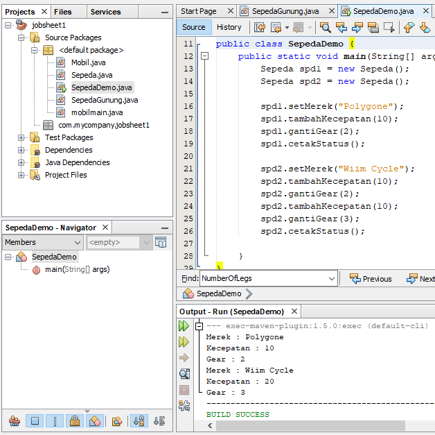
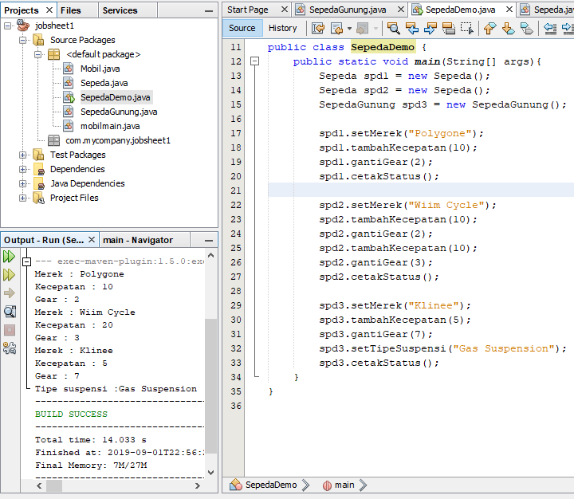
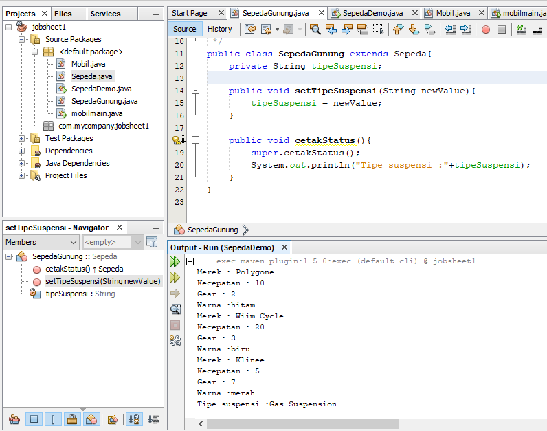
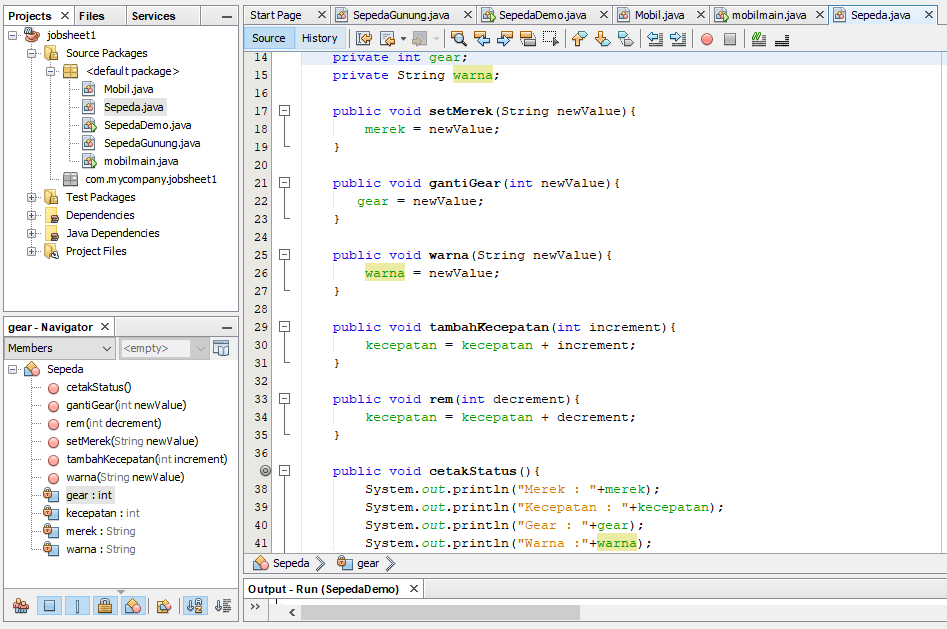
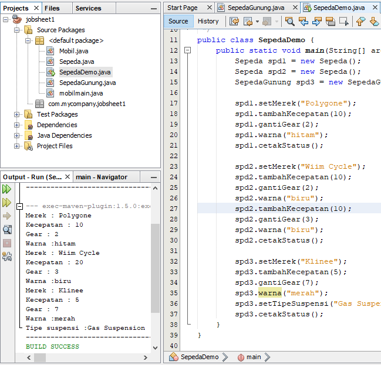
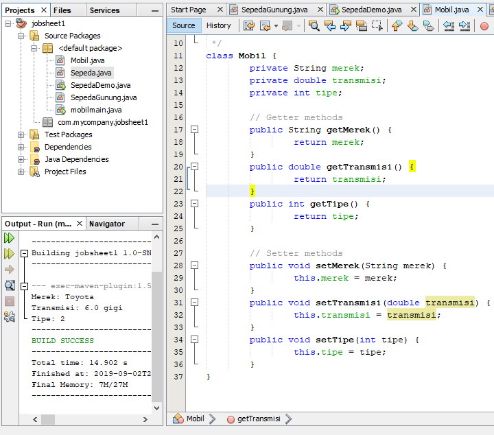
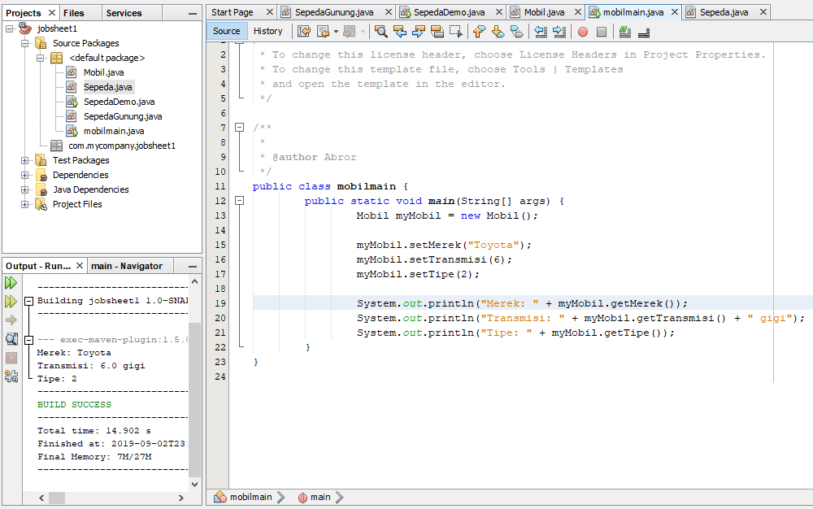

# Laporan Praktikum #1 - Pengantar Konsep PBO

## Kompetensi

Setelah menempuh materi percobaan ini, mahasiswa mampu mengenal:
1. Perbedaan paradigma berorientasi objek dengan paradigma struktural
2. Konsep dasar PBO

## Ringkasan Materi

Tidak gampang Tidak susah, santuy!

## Percobaan

### Percobaan 1
Didalam percobaan ini, kita akan mendemonstrasikan bagaimana membuat class, membuat object, kemudian mengakses method didalam class tersebut. 

Hasil :

Source Code :
Source code [sc1j1](../../src/1_Pengantar_Konsep_PBO/sc1j1.java)

Source code main [sc2j1](../../src/1_Pengantar_Konsep_PBO/sc2j1.java)

### Percobaan 2

Didalam percobaan ini, akan didemonstrasikan salah satu fitur yang paling penting dalam PBO, yaitu
inheritance. Disini kita akan membuat class SepedaGunung yang mana adalah turunan/warisan dari
class Sepeda. Pada dasarnya class SepedaGunung adalah sama dengan class Sepeda, hanya saja pada
sepeda gunung terdapat tipe suspensi. Untuk itu kita tidak perlu membuat class Sepeda Gunung dari
nol, tapi kita wariskan saja class Sepeda ke class SepedaGunung. 

Hasil :

Source Code :
Source code [sc3j1](../../src/1_Pengantar_Konsep_PBO/sc3j1.java)

Source code main [sc4j1](../../src/1_Pengantar_Konsep_PBO/sc4j1.java)

## Pertanyaan

1. Sebutkan dan jelaskan aspek-aspek yang ada pada pemrograman berorientasi objek!
2. Apa yang dimaksud dengan object dan apa bedanya dengan class?
3. Sebutkan salah satu kelebihan utama dari pemrograman berorientasi objek dibandingkan dengan pemrograman struktural!
4. Pada class Sepeda, terdapat state/atribut apa saja?
5. Tambahkan atribut warna pada class Sepeda.
6. Mengapa pada saat kita membuat class SepedaGunung, kita tidak perlu membuat class nya dari nol? 

1. 1. Object adalah suatu rangkaian dalam program yang terdiri dari state dan behaviour. Object pada software dimodelkan sedemikian rupa sehingga mirip dengan objek yang ada di dunia nyata. Objek memiliki state dan behaviour. State adalah ciri-ciri atau atribut dari objek tersebut. Sedangkan behaviour adalah perilaku yang dapat dilakukan objek tersebut. 
2. Class adalah blueprint atau prototype dari objek. Ambil contoh objek sepeda. Terdapat berbagai macam sepeda di dunia, dari berbagai merk dan model. Namun semua sepeda dibangun berdasarkan blueprint yang sama, sehingga tiap sepeda memiliki komponen dan karakteristik yang sama.
3. Disebut juga dengan information-hiding. Dalam berinteraksi dengan objek, seringkali kita tidak perlu mengetahui kompleksitas yang ada didalamnya. Contoh pada sepeda, ketika kita mengganti gear pada sepeda, kita tinggal menekan tuas gear yang ada di grip setang sepeda saja. Kita tidak perlu mengetahui bagaimana cara gear berpindah secara teknis. 
4. Disebut juga pewarisan. Inheritance memungkinkan kita untuk mengorganisir struktur program dengan natural. Inheritance juga memungkinkan kita untuk memperluas fungsionalitas program tanpa harus mengubah banyak bagian program.
5. Polimorfisme juga meniru sifat objek di dunia nyata, dimana sebuah objek dapat memiliki
bentuk, atau menjelma menjadi bentuk-bentuk lain.

2. Object adalah suatu rangkaian dalam program yang terdiri dari state dan behaviour. Object pada software dimodelkan sedemikian rupa sehingga mirip dengan objek yang ada di dunia nyata. Objek memiliki state dan behaviour. State adalah ciri-ciri atau atribut dari objek tersebut. Sedangkan behaviour adalah perilaku yang dapat dilakukan objek tersebut. Sedangkan Class adalah blueprint atau prototype dari objek. Ambil contoh objek sepeda. Terdapat berbagai macam sepeda di dunia, dari berbagai merk dan model. Namun semua sepeda dibangun berdasarkan blueprint yang sama, sehingga tiap sepeda memiliki komponen dan karakteristik yang sama.

3. Kelebihan PBO adalah program dapat lebih fleksibel dan modular, jika ada perubahan fitur, maka dapat dipastikan keseluruhan program tidak akan terganggu. Berbeda dengan struktural, perubahan sedikit fitur saja kemungkinan dapat mengganggu keseluruhan program.  

4. Merek, kecepatan, gear

5.   
    
6.  Karena sepdagunung merupakan warisan dari class sepeda jadi tinggal dipanggil dengan commands extends

## Tugas

Hasil :

 

Source code : [t1j1](../../src/1_Pengantar_Konsep_PBO/t1j1.java) [t2j1](../../src/1_Pengantar_Konsep_PBO/t2j1.java)

## Kesimpulan

Pemrograman berorientasi objek adalah sebuah teknik pemrograman yang memusatkan desain pada object dan class berdasarkan pada skenario dunia nyata. Hal ini menegaskan keadaan(state), behaviour dan interaksi dari object. Selain itu juga menyediakan manfaat akan kebebasan pengembangan, meningkatkan kualitas, mempermudah pemeliharaan, mempertinggi kemampuan dalam modifikasi dan meningkatkan penggunaan kembali software. 

## Pernyataan Diri

Saya menyatakan isi tugas, kode program, dan laporan praktikum ini dibuat oleh saya sendiri. Saya tidak melakukan plagiasi, kecurangan, menyalin/menggandakan milik orang lain.

Jika saya melakukan plagiasi, kecurangan, atau melanggar hak kekayaan intelektual, saya siap untuk mendapat sanksi atau hukuman sesuai peraturan perundang-undangan yang berlaku.

Ttd,

Abdulloh
