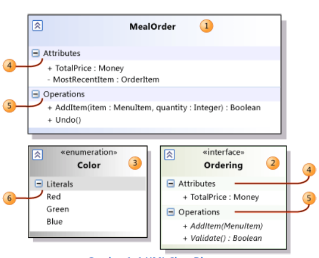
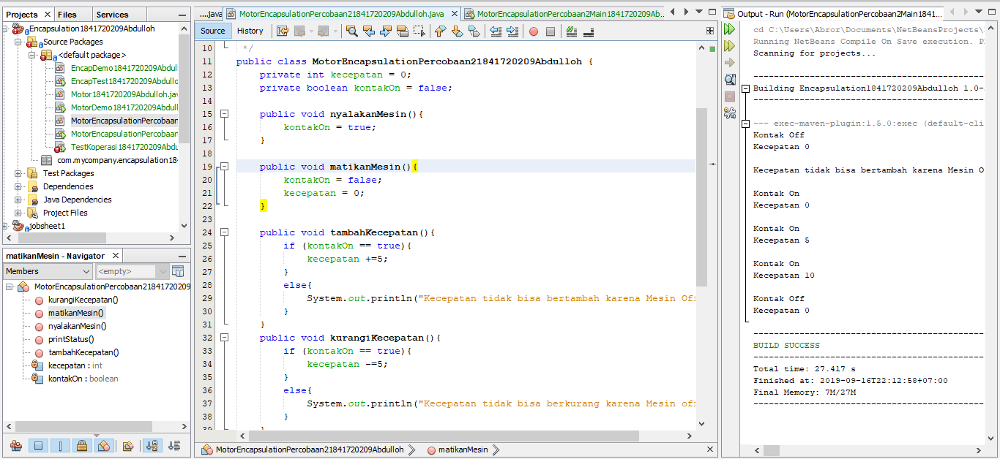
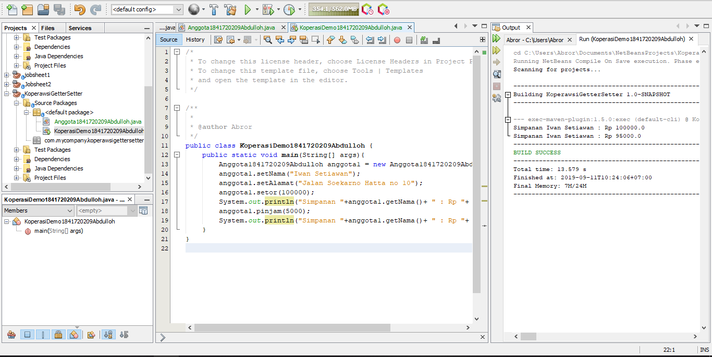

# Laporan Praktikum #2 - Pengantar Konsep PBO

## Kompetensi

Setelah melakukan percobaan pada modul ini, mahasiswa memahami konsep:
1. Konstruktor
2. Akses Modifier
3. Atribut/method pada class
4. Intansiasi atribut/method 
5. Setter dan getter
6. Memahami notasi pada UML Class Diagram 

## Ringkasan Materi

### Enkapsulasi

Pada modul pertama telah dijabarkan definisi dari enkapsulasi sebagai berikut:
Enkapsukasi disebut juga dengan information-hiding. Dalam berinteraksi dengan objek, seringkali kita tidak perlu mengetahui kompleksitas yang ada didalamnya. Hal ini akan lebih mudah dipahami jika kita membayangkan atau menganalisa objek yang ada disekitar kita, misalnya objek sepeda, ketika kita mengganti gear pada sepeda, kita tinggal menekan tuas gear yang ada di grip setang sepeda saja. Kita tidak perlu mengetahui bagaimana cara gear berpindah secara teknis. Contoh objek lain misalnya mesin penghisap debu (vacum cleaner), ketika kita mencolokkan kabel vacum cleaner dan menyalakan sakelarnya maka mesin tersebut siap digunakan untuk menghisap debu. Dalam proses tersebut kita tidak mengetahui proses rumit yang terjadi ketika mengubah listrik menjadi tenaga dari vacum cleaner. Dalam contoh diatas vacum cleaner dan sepeda telah menerapkan enkapsulasi atau disebut juga information-hiding atau data hiding karena menyembunyikan detail proses suatu objek dari pengguna.

### Konstruktor
Konstruktor mirip dengan method cara deklarasinya akan tetapi tidak memiliki tipe return. Dan konstruktor dieksekusi ketika instan dari objek dibuat. Jadi setiap kali sebuat objek dibuat dengan keyword new() maka konstruktor akan dieksekusi. Cara untuk membuat konstruktor adalah sebagai berikut: 
1. Nama konstruktor harus sama dengan nama class
2. Konstruktor tidak memiliki tipe data return
3. Konstruktor tidak boleh menggunakan modifier abstract, static, final, dan syncronized 
Note: Di java kita dapat memiliki konstruktor dengan modifier private, protected, public or default. 

### Akses Modifier
Terdapat 2 tipe modifier di java yaitu : akses modifier dan non-access modifier. Dalam hal ini kita akan fokus pada akses modifier yang berguna untuk mengatur akses method, class, dan constructor. Terdapat 4 akses modifier yaitu:
1. private – hanya dapat diakses di dalam kelas yang sama
2. default –  hanya dapat diakses di dalam package yang sama
3. protected – dapat diakases di luar package menggunakan subclass  (membuat inheritance)
4. public – dapat diakases dari mana saja 

Tabel Detail Acces Modifier

### Getter dan Setter
Getter adalah public method dan memiliki tipe data return, yang berfungsi untuk mendapatkan nilai dari atribut private. Sedangkan setter adalah public method yang tidak memliki tipe data return, yang berfungsi untuk memanipulasi nilai dari atribut private.

### Notasi UML Class Diagram 
Secara umum bentuk UML class diagram adalah seperti pada Gambar .. 

Keterangan :
1. Class
2. Interface
3. Enumeration – adalah tipe data yang memiliki nilai atau literal yang terbatas.
4. Atrributes
5. Method
6. Literals 
Notasi akses modifier pada UML class diagram adalah sebagai berikut:
1. Tanda plus (+) untuk public
2. Tanda pagar (#)  untuk protected
3. Tanda  minus (-) untuk private
4. Untuk default, maka tidak diberi notasi 

## Percobaan

### Percobaan 1
Didalam percobaan enkapsulasi, buatlah class Motor yang memiliki atribut kecepatan dan kontakOn, dan memiliki method printStatus() untuk menampilkan status motor. Seperti berikut 
1. Buka Netbeans, buat project MotorEncapsulation.
2. Buat class Motor. Klik kanan pada package motorencapsulation – New – Java Class.
3. Ketikkan kode class Motor dibawah ini. 

Hasilnya adalah sebagai berikut:

Link kode program : [Motor1841720209Abdulloh.java](../../src/3_Enkapsulasi/Motor1841720209Abdulloh.java)

Link kode program main: [MotorDemo1841720209Abdulloh.java](../../src/3_Enkapsulasi/MotorDemo1841720209Abdulloh.java)

### Percobaan 2

Pada percobaan ini akan digunakan access modifier untuk memperbaiki cara kerja class Motor pada
percobaan ke-1.
1. Ubah cara kerja class motor sesuai dengan UML class diagram berikut. 

2. Berdasarkan UML class diagram tersebut maka class Motor terdapat perubahan, yaitu :
a. Ubah access modifier kecepatan dan kontakOn menjadi private
b. Tambahkan method nyalakanMesin, matikanMesin, tambahKecepatan,
kurangiKecepatan. 
3. Hasilnya dari class MotorDemo adalah sebagai berikut: 

Link kode program : [MotorEncapsulationPercobaan21841720209Abdulloh.java](../../src/3_Enkapsulasi/MotorEncapsulationPercobaan21841720209Abdulloh.java)

Link kode program main : [MotorEncapsulationPercobaan2Main1841720209Abdulloh.java](../../src/3_Enkapsulasi/MotorEncapsulationPercobaan2Main1841720209Abdulloh.java)

### Pertanyaan 
1.	Pada class TestMotor, saat kita menambah kecepatan untuk pertama kalinya, mengapa muncul peringatan “Kecepatan tidak bisa bertambah karena Mesin Off!”?
-   Karena status kontak masih off, sehingga  kecepatan tidak bisa ditambah kecuali dinyalakan terlebih dahulu

2.	Mengapa atribut kecepatan dan kontakOn diset private?

-   Agar tidak bisa diambil oleh class lain, sehingga atribut kecepatan pada class Motor.java tidak bisa diganti nilainya kecuali dengan method khusus pada class MotorDemo.java 

3.	Ubah class Motor sehingga kecepatan maksimalnya adalah 100!

### Percobaan 3
Misalkan di sebuah sistem informasi koperasi, terdapat class Anggota. Anggota memiliki atribut nama, alamat dan simpanan, dan method setter, getter dan setor dan pinjam. Semua atribut pada
anggota tidak boleh diubah sembarangan, melainkan hanya dapat diubah melalui method setter, getter, setor dan tarik. Khusus untuk atribut simpanan tidak terdapat setter karena simpanan akan
bertambah ketika melakukan transaksi setor dan akan berkurang ketika melakukan peminjaman/tarik. 

1. Berikut ini UML class buatlah class Mahasiswa pada program: 

2. Hasil dari main method pada langkah ketiga adalah :

Link kode program : [Anggota1841720209Abdulloh.java](../../src/3_Enkapsulasi/Anggota1841720209Abdulloh.java)

Link kode program main : [KoperasiDemo1841720209Abdulloh.java](../../src/3_Enkapsulasi/KoperasiDemo1841720209Abdulloh.java)

### Percobaan 4
Pada class Anggota dibuat kontruktor dengan access modifier default yang memiliki 2 parameter nama dan alamat. Dan didalam konstruktor tersebut dipastikan nilai simpanan untuk pertama kali adalah Rp. 0. 

1. Hasil dari program tersebut adalah sebagai berikut 

Setelah menambah konstruktor pada class Anggoata maka atribut nama dan alamat secara otomatis harus diset terlebih dahulu dengan melakukan passing parameter jika melakukan instansiasi class Anggota. Hal ini biasa dilakukan untuk atribut yang membutuhkan nilai yang spesifik. Jika tidak membutuhkan nilai spesifik dalam konstruktor tidak perlu parameter. Contohnya simpanan untuk anggota baru diset 0, maka simpanan tidak perlu untuk dijadikan parameter pada konstruktor. 

Link kode program : [AnggotaPercobaan41841720209Abdulloh.java](../../src/3_Enkapsulasi/AnggotaPercobaan41841720209Abdulloh.java)

Link kode program main : [KoperasiDemoPercobaan41841720209Abdulloh.java](../../src/3_Enkapsulasi/KoperasiDemoPercobaan41841720209Abdulloh.java)

### Pertanyaan - Percobaan 3 dan 4

1. Apa yang dimaksud getter dan setter?
2. Apa kegunaan dari method getSimpanan()?
3. Method apa yang digunakan untk menambah saldo?
4. Apa yand dimaksud konstruktor?
5. Sebutkan aturan dalam membuat konstruktor?
6. Apakah boleh konstruktor bertipe private?
7. Kapan menggunakan parameter dengan passsing parameter?
8. Apa perbedaan atribut class dan instansiasi atribut?
9. Apa perbedaan class method dan instansiasi method?

JAWAB :
1. Getter adalah metode yang membaca nilai suatu variabel. Setter adalah metode yang memperbarui nilai suatu variabel. Getter dan setter juga dikenal sebagai accessor dan mutator di Java. Setter sering digunakan untuk meng – set nilai atribut ke dalam variable, Getter digunakan untuk mengambil nilai atribut dan di return-kan (dikembalikan). Getter mulai dengan get, lalu diikuti dengan nama variabel, dengan huruf pertama dari nama variabel dikapitalisasi. Setter mulai dengan set, diikuti dengan nama variabel, dengan huruf pertama dari nama variabel dikapitalisasi.
2. Berguna untuk Khusus untuk atribut simpanan tidak terdapat setter karena simpanan akan bertambah ketika melakukan transaksi setor dan akan berkurang ketika melakukan peminjaman/tarik. 
3. getSaldo();
4. Constructor adalah method khusus yang akan dieksekusi pada saat pembuatan objek (instance). Biasanya method ini digunakan untuk inisialisasi atau mempersiapkan data untuk objek.
5. Suatu constructor dapat di overload, Nama Constructor harus sama dengan nama class, Constructor tidak boleh mengembalikan nilai, Hanya compiler yang membuat default constructor, Suatu Constructor bisa memiliki acces modifer private
6. Meskipun tampak aneh, tapi hal ini bisa dilakukan. Constructor dengan acces modifier private dapat diterapkan pada class Singleton atau biasa dikenal dengan Singleton pattern untuk membuat objek tunggal. Dengan membuat constructor class menjadi private maka class tersebut tidak bisa dibuat instancenya diluar class tersebut.
7. Setelah menambah konstruktor pada class Anggoata maka atribut nama dan alamat secara otomatis harus diset terlebih dahulu dengan melakukan passing parameter jika melakukan instansiasi class Anggota
8. Class merupakan brueprint dari prototype dari objek, kalau instansiasi dibunakan untuk memanggil sebuah objek dari class yang lain.
9. Method merupakan suatu operasi berupa fungsi-fungsi yang dapat dikerjakan oleh suatu object. Kalau class method bisa mengubah simpanan tidak dilakukan secara langsung dengan mengubah atribut simpanan kalau instansiasi tidak

## Tugas

#### 1. Cobalah program dibawah ini dan tuliskan hasil outputnya 

Link kode program : [AnggotaPercobaan41841720209Abdulloh.java](../../src/3_Enkapsulasi/AnggotaPercobaan41841720209Abdulloh.java)

Link kode program main : [KoperasiDemoPercobaan41841720209Abdulloh.java](../../src/3_Enkapsulasi/KoperasiDemoPercobaan41841720209Abdulloh.java)

#### 2. Pada program diatas, pada class EncapTest kita mengeset age dengan nilai 35, namun pada saat ditampilkan ke layar nilainya 30, jelaskan mengapa.

Penjelasan:
Public String getName()) untuk membuat method getName, Public void setName() dengan parameter String newname untuk membuat method setName, Public int getAge() untuk membuat method getAge, dan Public void setAge() dengan parameter int newAge untuk mengeliminasi jika atribut newAge lebih besar dari 30 akan muncul output age = 30 sedangkan atribut new age kurang dari 30 akan muncul output newAge.  

##### 3. Ubah program diatas agar atribut age dapat diberi nilai maksimal 30 dan minimal 18.

Link kode program : [AnggotaPercobaan41841720209Abdulloh.java](../../src/3_Enkapsulasi/AnggotaPercobaan41841720209Abdulloh.java)

Link kode program main : [KoperasiDemoPercobaan41841720209Abdulloh.java](../../src/3_Enkapsulasi/KoperasiDemoPercobaan41841720209Abdulloh.java)

Penjelasan:
Public String getName()) untuk membuat method getName, Public void setName() dengan parameter String newname untuk  membuat method setName, Public int getAge() untuk membuat method getAge.
Public void setAge() dengan parameter int newAge untuk mengeliminasi jika atribut newAge lebih besar dari 30 akan muncul output age = 30 sedangkan atribut new age kurang dari 30 akan muncul output newAge

#### 4. Pada sebuah sistem informasi koperasi simpan pinjam, terdapat class Anggota yang memiliki atribut antara lain nomor KTP, nama, limit peminjaman, dan jumlah pinjaman. Anggota dapat meminjam uang dengan batas limit peminjaman yang ditentukan. Anggota juga dapat mengangsur pinjaman. Ketika Anggota tersebut mengangsur pinjaman, maka jumlah pinjaman akan berkurang sesuai dengan nominal yang diangsur. Buatlah class Anggota tersebut, berikan atribut, method dan konstruktor sesuai dengan kebutuhan. Uji dengan TestKoperasi berikut ini untuk memeriksa apakah class Anggota yang anda buat telah sesuai dengan yang diharapkan.

Link kode program : [AnggotaTugas41841720209Abdulloh.java.java](../../src/3_Enkapsulasi/AnggotaTugas41841720209Abdulloh.java.java)

Link kode program : [TestKoperasiTugas41841720209Abdulloh.java](../../src/3_Enkapsulasi/TestKoperasiTugas41841720209Abdulloh.java)

#### 5. Modifikasi soal no. 4 agar nominal yang dapat diangsur minimal adalah 10% dari jumlah pinjaman saat ini. Jika mengangsur kurang dari itu, maka muncul peringatan “Maaf, angsuran harus 10% dari jumlah pinjaman”.

Link kode program : [AnggotaTugas51841720209Abdulloh.java](../../src/3_Enkapsulasi/AnggotaTugas51841720209Abdulloh.java)

Link kode program main : [TestKoperasi51841720209Abdulloh.java](../../src/3_Enkapsulasi/TestKoperasi51841720209Abdulloh.java)

Penjelasan:
• public String getKtp() untuk membuat method ktp
• public String getNama() untuk membuat method nama
• public int getLimitPeminjaman() untuk membuat method limitPeminjaman 
• public int getJumlahPeminjaman() untuk membuat method jumlahPinjaman
• public void pinjam(int uang) untuk membuat method dengan ini untuk
mengeliminasikan uang lebih besar dari limitPeminjaman outputnya akan
muncul System.out.println("Maaf, jumlah pinjaman melebihi limit.");
sedangkan itu akan muncul yang lain public void angsur(int uang) untuk membuat method jumlah pinjaman uang jika uang lebih kecil dari pinjaman uang akan muncul output jumlah pinjaman uang sedangkan
jika lebih besar maka muncul output ("Maaf, angsuran harus 10% dari jumlah pinjaman");

#### 6. Modifikasi class TestKoperasi, agar jumlah pinjaman dan angsuran dapat menerima input dari console.

Link kode program : [TestKoperasi61841720209Abdulloh.java](../../src/3_Enkapsulasi/TestKoperasi61841720209Abdulloh.java)

## Kesimpulan

Dari percobaan diatas, telah dipelajari kosep dari enkapsulasi, kontruktor, access modifier yang terdiri dari 4 jenis yaitu public, protected, default dan private. Konsep atribut atau method class
yang ada di dalam blok code class dan konsep instansiasi atribut atau method. Cara penggunaan getter dan setter beserta fungsi dari getter dan setter. Dan juga telah dipelajari atau memahami notasi UML

## Pernyataan Diri

Saya menyatakan isi tugas, kode program, dan laporan praktikum ini dibuat oleh saya sendiri. Saya tidak melakukan plagiasi, kecurangan, menyalin/menggandakan milik orang lain.

Jika saya melakukan plagiasi, kecurangan, atau melanggar hak kekayaan intelektual, saya siap untuk mendapat sanksi atau hukuman sesuai peraturan perundang-undangan yang berlaku.

Ttd,

Abdulloh