# Laporan Praktikum #4 - Relasi dan Kelas

## Kompetensi
Setelah menempuh pokok bahasan ini, mahasiswa mampu:
1. Memahami konsep relasi kelas;
2. Mengimplementasikan relasi has‑a dalam program. 

## Ringkasan Materi

Pada kasus yang lebih kompleks, dalam suatu sistem akan ditemukan lebih dari satu class  yang saling memiliki keterkaitan antara class satu dengan yang lain. Pada percobaan‑percobaan sebelumnya, mayoritas kasus yang sudah dikerjakan hanya fokus pada satu class saja. Pada jobsheet ini akan dilakukan percobaan yang melibatkan beberapa class yang saling berelasi. Misalnya terdapat class Laptop yang memiliki atribut berupa merk dan prosesor. Jika diperhatikan lebih rinci, maka atribut prosesor sendiri didalamnya memiliki data berupa merk, nilai cache memori, dan nilai clock‑nya. Artinya, ada class lain yang namanya Processor yang memiliki atribut merk, cache dan clock, dan atribut prosesor yang ada di dalam class Laptop itu merupakan objek dari class Proceessor tersebut. Sehingga terlihat antara class Laptop dan class Processor memiliki relasi (has‑a).

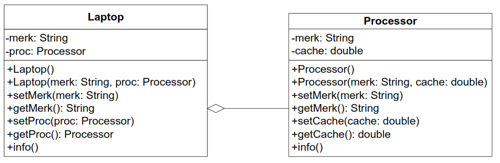

Jenis relasi has‑a ini yang akan dicontohkan pada percobaan di jobsheet ini. Apabila dilihat lebih rinci lagi, relasi tersebut disebut juga dengan agregasi (has-a). Relasi antar kelas yang lain adalah dependensi (uses-a) dan inheritance (is-a). Diperlukan inisiatif mandiri dari tiap mahasiswa untuk memperdalam jenis relasi lain terutama yang tidak dibahas pada mata kuliah ini. 

## Percobaan

### Percobaan 1

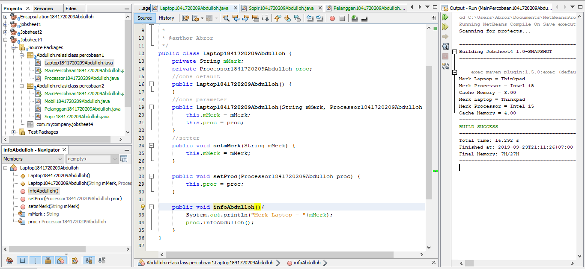

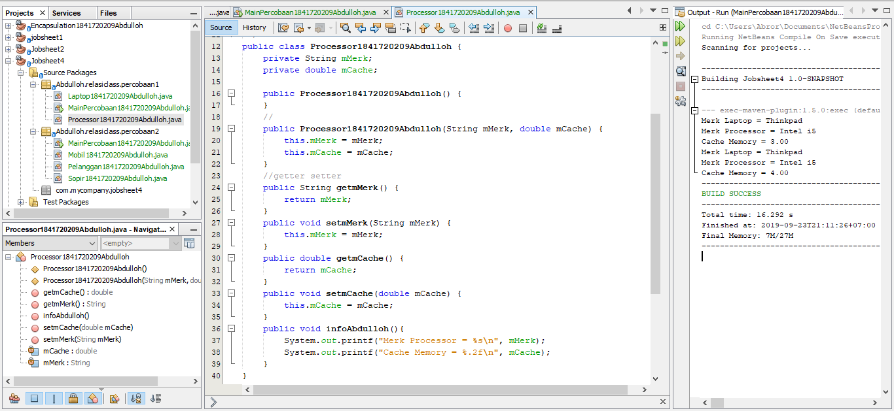

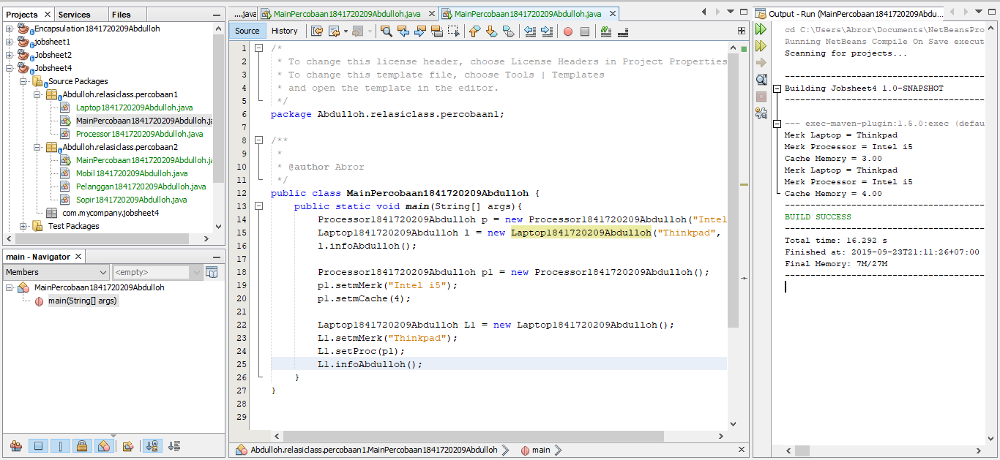

Link kode program 1: [Processor1841720209Abdulloh.java](../../src/4_Relasi_Class/Processor1841720209Abdulloh.java)

Link kode program 2: [Laptop1841720209Abdulloh.java](../../src/4_Relasi_Class/Laptop1841720209Abdulloh.java)

Link kode program main : [MainPercobaan1841720209Abdulloh.java](../../src/4_Relasi_Class/MainPercobaan1841720209Abdulloh.java)

### Pertanyaan
1.	Di dalam class Processor dan class Laptop, terdapat method setter dan getter untuk masing-masing atributnya. Apakah gunanya method setter dan getter tersebut?

Jawab : Guna method setter dan getter tidak lain ialah untuk menge-set (memberi nilai) dan menge-get (mendapatkan/melihat nilai) pada suatu variabel atau class dengan contructor default

2.	Di dalam class processor dan class Laptop, masing-masing terdapat kontruktor default dan kontruktor berparameter. Bagaimana beda penggunaan dari kedua jenis konstruktor tersebut?

Jawab : Perbedaan pengunaan dari kedua jenis konstruktor apabila konstruktor default memberi nilai menggunakan setter, tetapi jika kita menggunakan konstruktor berparameter, kita hanya perlu memberi nilai di parameter pada objek di class main.

3.	Perhatikan class Laptop, diantara 2 atribut yang dimiliki (merk dan proc), atribut mana yang bertipe object?

Jawab : Atribut yang bertipe object adalah proc, karena inisiasi tipe variabel ditandai dengan nama object.

4. Perhatikan class Laptop, pada baris manakah yang menunjukan bahwa class Laptop memiliki relasi dengan class Processor?

Jawab :  Baris yang menunjukkan class Laptop memiliki relasi dengan class Processor terlihat jelas pada constructor, terdapat parameter yang menggunakan object Processor yang telah diinisiasi sebelumnya

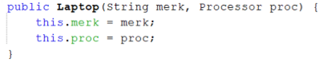

5.	Perhatikan class Laptop, apakah guna dari sintaks proc.Info()?

Jawab : Guna sintaks proc.Info() ialah syntax yang digunakan untuk menjalankan method Info() pada class Processor.

6.	Pada class MainPercobaan1, terdapat baris kode Laptop l = new Laptop(“Thinkpad”, p);  . apakah p tersebut? Dan apakah yang tejadi jika baris tersebut diubah menjadi Laptop l = new Laptop(“Thinkpad”, new Processor(“Intel i5”, 3)); . Bagaimana hasil program saat dijalankan, apakah ada perubahan?

Jawab : p merupakan object dari class Processor yang tadi telah diinstansiasi, Lalu kode program yang baru hasilnya sama saja, kode program tersebut memiliki perbedaan pada instansiasi dalam bentuk variabel object, bila pada kode program tersebut object tidak perlu diinstansiasi kedalam variabel lain tetapi ter nested atau bisa dibilang melakukan instansiasi objek dialam instansiasi object.

### Percobaan 2

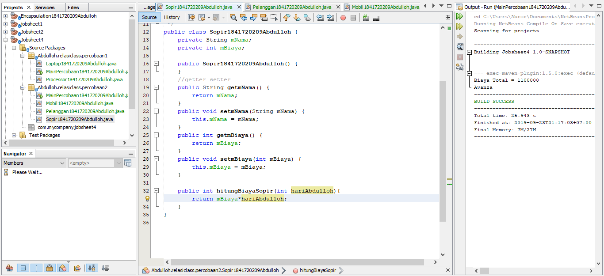

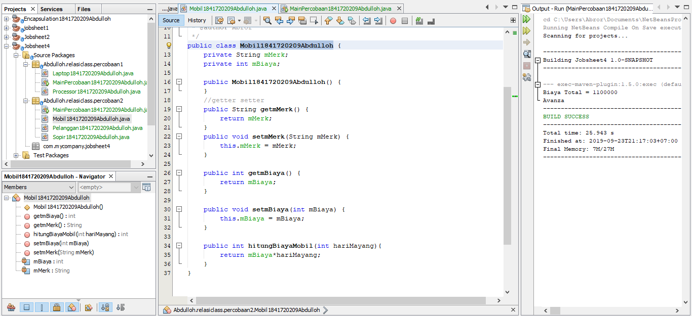

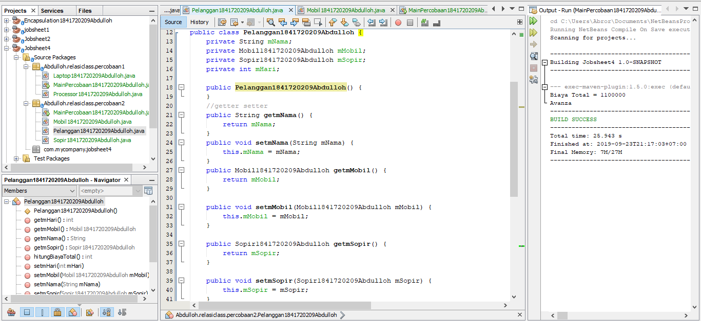

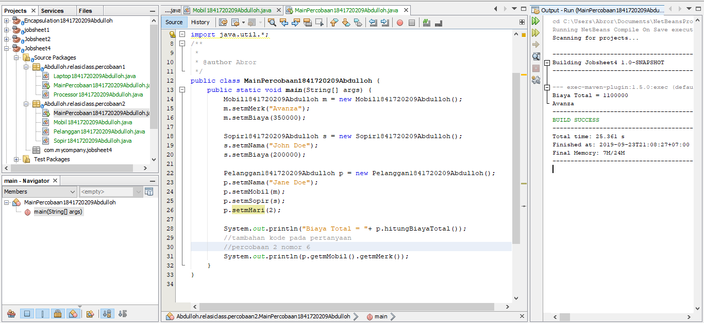

Link kode program 1: [Sopir1841720209Abdulloh.java](../../src/4_Relasi_Class/Sopir1841720209Abdulloh.java)

Link kode program 2: [Mobil1841720209Abdulloh.java](../../src/4_Relasi_Class/Mobil1841720209Abdulloh.java)

Link kode program 3: [Pelanggan1841720209Abdulloh.java](../../src/4_Relasi_Class/Pelanggan1841720209Abdulloh.java)

Link kode program main : [MainPercobaan21841720209Abdulloh.java](../../src/4_Relasi_Class/MainPercobaan21841720209Abdulloh.java)

### Pertanyaan
1. Perhatikan class Pelanggan. Pada baris program makanan yang menunjukan bahwa class Pelanggan memiliki relasi dengan class Mobil dan class Sopir?

Jawab :  Dapat dilihat pada inisiasi variabel object di class pelanggan

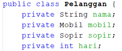

2.	Perhatikan method hitungBiayaSopir pada class Sopir, serta method hitungBiayaMobil pada calss Mobil. Mengapa menurut anda method tersebut harus memiliki argument hari?

Jawab : Menurut saya argumen tersebut nantinya digunakan untuk diisi dengan variabel int hari pada class Pelanggan 

3.	Perhatikan class Pelanggan. Untuk apakah perintah
mobil.hitungBiayaMobil(hari) dan sopir.hitungBiayaSopir(hari)?

Jawab : Perintah mobil.hitungBiayaMobil(hari) dan sopir.hitungBiayaSopir(hari) adalah untuk menjumlahkan biaya mobil yang diambil dari harga sopir dikali dengan hari lalu yang dijumlahkan dengan biaya sopir yang diambil dari harga sopir dikali hari.

4.	Perhatikan class MainPercobaan2. Untuk apakah sintaks p.setMobil(m) dan p.setSopir(s)?

Jawab : Sintaks p.setMobil(m) dan p.setSopir(s) kode program tersebut digunakan untuk memberi atau mengisi nilai dari namaMobil dan namaSopir yang ada pada objek pelanggan

5.	Perhatikan class MainPercobaan2. Untuk apakah proses p.hitungBiayaTotal() tersebut?

Jawab : Proses p.hitungBiayaTotal() berguna untuk menghitung biaya total dari penjumlahan antara biaya sopir dan biaya mobil.

6.	Perhatikan class MainPercobaan2 coba tambahkan pada baris terakhir dari method main dan amati perubahan saat di-run!

System.out.println(p.getMobil().getMerk(); 

Jadi untuk apakah sintaks diatas yang ada didalam method main tersebut?

Jawab : Perintah tersebut digunakan untuk mengembalikan atau me return nilai atribut dari method  getMerk() pada class Mobil melalui objek pelanggan, atau setelah me return object Mobil pada class pelanggan, object mobil akan me return String getMerk() pada class mobil

### Percobaan 3

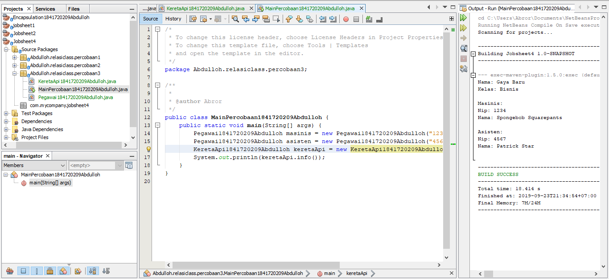

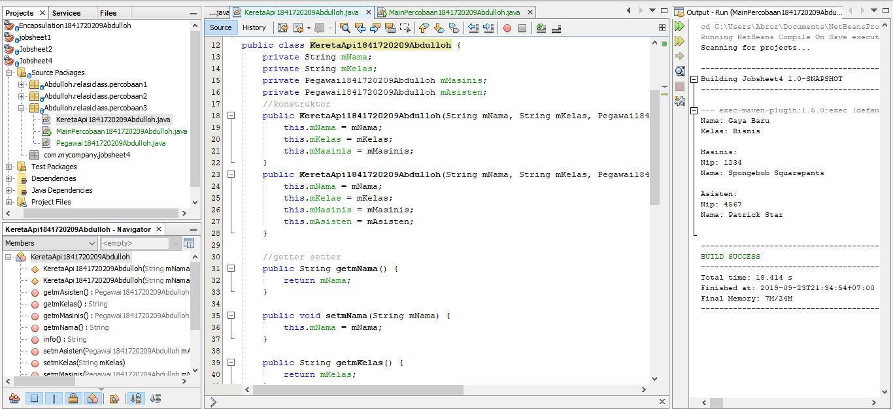

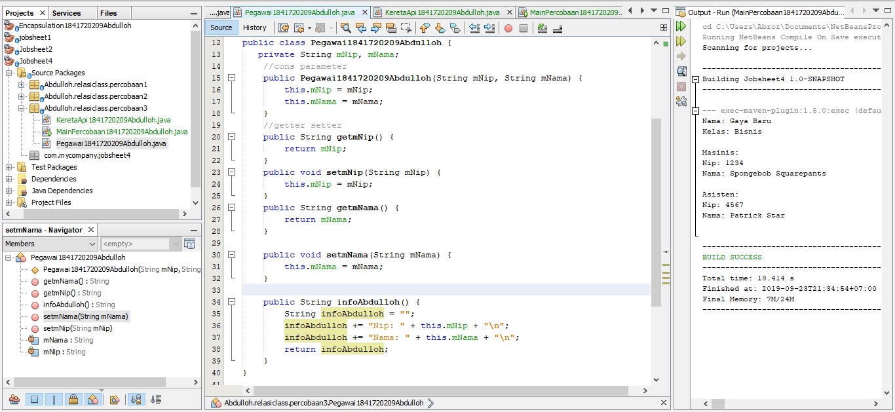

Link kode program 1: [KeretaApi1841720209Abdulloh.java](../../src/4_Relasi_Class/KeretaApi1841720209Abdulloh.java)

Link kode program 2: [Pegawai1841720209Abdulloh.java](../../src/4_Relasi_Class/Pegawai1841720209Abdulloh.java)

Link kode program main : [MainPercobaan31841720209Abdulloh.java](../../src/4_Relasi_Class/MainPercobaan31841720209Abdulloh.java)

### Pertanyaan
1.	Dalam method info() pada class KeretaApi, baris this.masinis.info() dan this.asisten.info() digunakan untuk apa?

Jawab : digunakan untuk memanggil method Info yang berada di class Pegawai melalui object masinis dan asisten

2.	Buatlah main program baru dengan nama class MainPertanyaan pada package yang sama. Tambahkan kode berikut pada method main()

Jawab : 

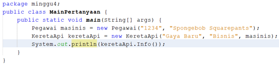

3.	Apakah hasil output dari main program tersebut? Mengapa hal tersebut dapat terjadi?

Jawab : 

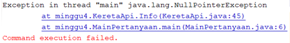

Hasil output itu terjadi karena ada variabel yang tidak bernilai atau disebut dengan null, dan variabel tersebut adalah object asisten pada class KeretaApi

4.	Perbaiki class KeretaApi sehingga program dapat berjalan

Jawab : 

### Percobaan 4

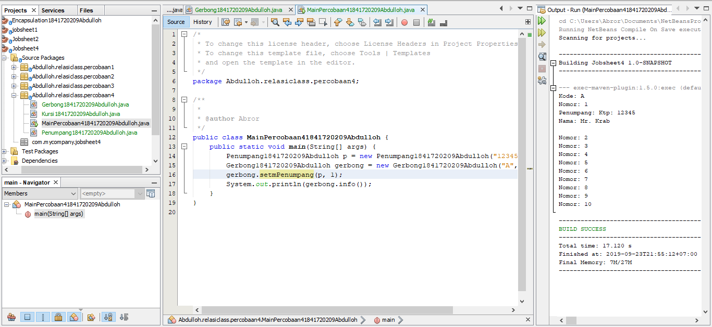

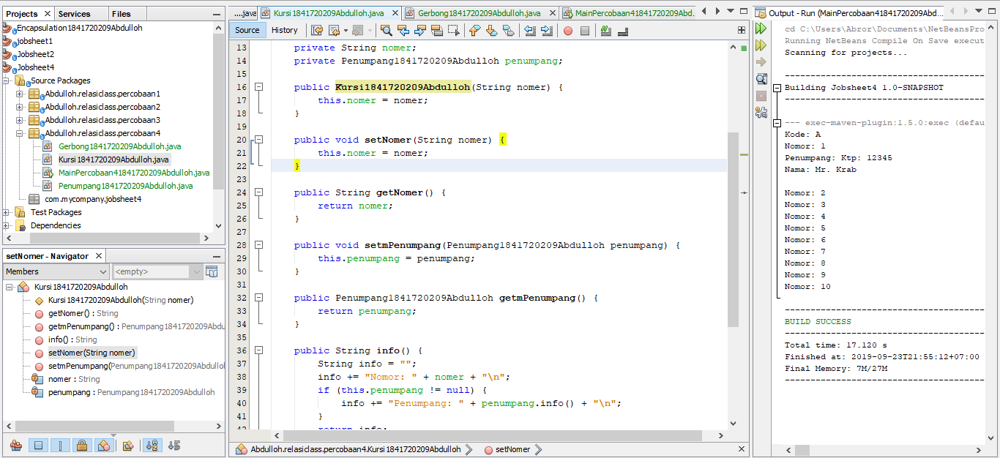

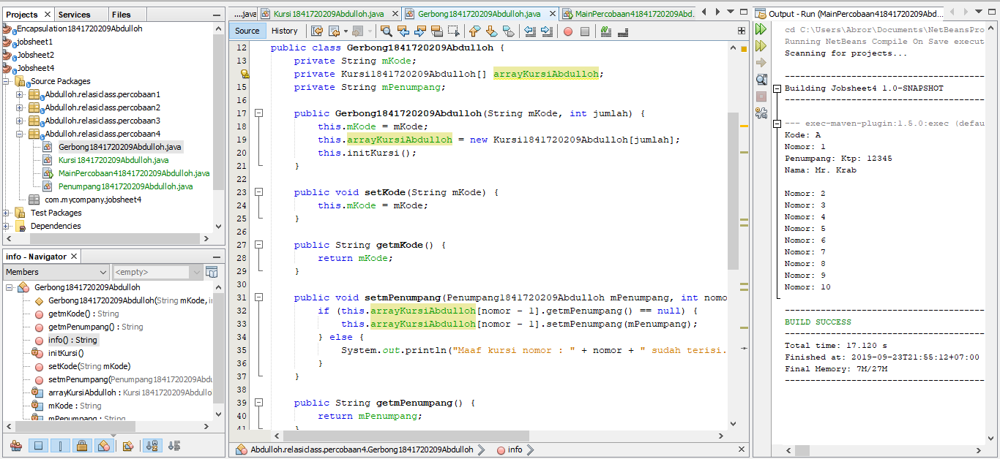

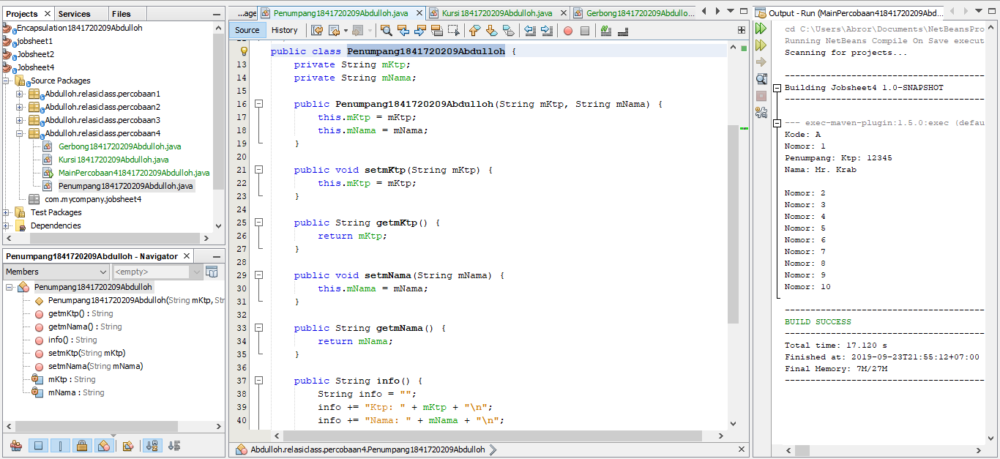

Link kode program 1: [Kursi1841720209Abdulloh.java](../../src/4_Relasi_Class/Kursi1841720209Abdulloh.java)

Link kode program 2: [Gerbong1841720209Abdulloh.java](../../src/4_Relasi_Class/Gerbong1841720209Abdulloh.java)

Link kode program 3: [Penumpang1841720209Abdulloh.java](../../src/4_Relasi_Class/Penumpang1841720209Abdulloh.java)

Link kode program main : [MainPercobaan41841720209Abdulloh.java](../../src/4_Relasi_Class/MainPercobaan41841720209Abdulloh.java)

### Pertanyaan
1.	Pada main program dalam class MainPercobaan4, berapakah jumlah kursi dalam Gerbong A?

Jawab : Terdapat 10 dalam gerbong A pada main program dalam class MainPercobaan4, dapat dilihat pada instansiasi new Gerbong atau pada output bisa dilihat perulangan “Nomer : 10”

2.	Perhatikan potongan kode pada method info() dalam class Kursi. Apa maksud kode tersebut

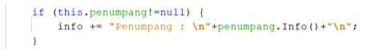

Jawab : Maksud kode tersebut ialah digunakan untuk menampilkan kursi yang terisi oleh penumpang, tetapi bila penumpang tidak bernilai atau null, maka kode program yang terdapat pada if tidak dijalankan atau berarti kursi tersebut masih kosong

3.	Mengapa pada method setPenumpang() dalam class Gerbang, nilai nomer dikurangi dengan angka 1?

Jawab : Nilai nomor dikurangi angka 1 karena index array selalu dimulai dari 0, oleh karena itu nilai nomer harus dikurangi 1 agar array di index 0 atau di index pertama dapat terisi

4.	Intansiasi object baru budi dengan tipe Penumpang, kemudian masukan object baru tersebut pada gerbong dengan gerbong.setPenumpang(budi,1). Apakah yang terjadi?

Jawab : Kode program :

5.	Modifikasi program sehingga, tidak diperkenankan untuk menduduki kursi yang sudah ada penumpang lain!

Jawab : Kode program pada class Gerbong :
asdasdasd

## Tugas
Buatlah sebuah studi kasus, rancang dengan class diagram, kemudian implementasikan ke dalam program! Studi kasus harus mewakili relasi class dari percobaan‑percobaan yang telah dilakukan pada materi ini, setidaknya melibatkan minimal 4 class (class yang berisi main tidak dihitung).

Jawab:

## Kesimpulan

Dari percobaan diatas, telah dipelajari kosep dari enkapsulasi, kontruktor, access modifier yang terdiri dari 4 jenis yaitu public, protected, default dan private. Konsep atribut atau method class
yang ada di dalam blok code class dan konsep instansiasi atribut atau method. Cara penggunaan getter dan setter beserta fungsi dari getter dan setter. Dan juga telah dipelajari atau memahami notasi UML

## Pernyataan Diri

Saya menyatakan isi tugas, kode program, dan laporan praktikum ini dibuat oleh saya sendiri. Saya tidak melakukan plagiasi, kecurangan, menyalin/menggandakan milik orang lain.

Jika saya melakukan plagiasi, kecurangan, atau melanggar hak kekayaan intelektual, saya siap untuk mendapat sanksi atau hukuman sesuai peraturan perundang-undangan yang berlaku.

Ttd,

Abdulloh