# Laporan Praktikum #6 - Inheritance

## Kompetensi
Setelah menempuh pokok bahasan ini, mahasiswa mampu:
1. Memahami konsep dasar inheritance atau pewarisan. 
2. Mampu membuat suatu subclass dari suatu superclass tertentu. 
3. Mampu mengimplementasikan konsep single dan multilevel inheritance. 
4. Mampu membuat objek dari suatu subclass dan melakukan pengaksesan terhadap atribut 
dan method baik yang dimiliki sendiri atau turunan dari superclass nya. 

## Ringkasan Materi

Inheritance atau pewarisan sifat merupakan suatu cara untuk menurunkan suatu class yang 
lebih umum menjadi suatu class yang lebih spesifik. Inheritance adalah salah satu ciri utama suatu 
bahasa program yang berorientasi pada objek. Inti dari pewarisan adalah sifat reusable dari konsep 
object  oriented.  Setiap  subclass  akan  “mewarisi”  sifat  dari  superclass  selama  bersifat  protected 
ataupun public. Dalam  inheritance  terdapat  dua  istilah  yang  sering  digunakan.  Kelas  yang  menurunkan  disebut kelas dasar (base class/super class), sedangkan kelas yang diturunkan disebut kelas turuna (derived  class/sub  class/child  class)  .  Di  dalam  Java  untuk  mendeklarasikan  suatu  class  sebagai 
subclass  dilakukan  dengan  cara  menambahkan  kata  kunci  extends  setelah  deklarasi  nama  class, 
kemudian diikuti dengan nama parent classnya. Kata kunci extends tersebut memberitahu kompiler  Java bahwa kita ingin melakukan perluasan class. Berikut adalah contoh deklarasi inheritance. Karakteristik  pada  super  class  akan  dimiliki  juga  oleh  subclassnya.  Terdapat  3  bentuk pewarisan:  single  inheritance,  multilevel  inheritance,  dan  multiple  inheritance.  Namun  yang  akan dibahas pada jobsheet ini adalah single inheritance dan multilevel inheritance. 
1. Single Inheritance 
Single inheritance adalah Suatu class yang hanya mempunyai satu parent class.
2. Multilevel Inheritance 
Multilevel  inheritance  adalah  Suatu  subclass  bisa  menjadi  superclass  bagi  class  yang  lain. 
Pada class diagram, pewarisan digambarkan dengan sebuah garis tegas, dengan segitiga di ujungnya.  

Class  yang  dekat  pada  segitiga  merupakan  superclass,  sedangkan  class  yang  jauh  dari segitiga  merupakan  subclass.  Untuk  membentuk  sebuah  subclass,  keyword  “extends”  digunakan (lihat  contoh  pada  sesi  “Implementasi  Pewarisan”). Suatu  parent  class  dapat  tidak  mewariskan  sebagian  member-nya  kepada  subclassnya.  Sejauh  mana  suatu  member  dapat  diwariskan  ke  class  lain,  ataupun  suatu  member  dapat  diakses dari  class  lain,  sangat  berhubungan  dengan  access  control  (kontrol  pengaksesan). 

Kata kunci super dipakai untuk merujuk pada member dari parent class. Sebagaimana kata 
kunci  this  yang  dipakai  untuk  merujuk  pada  member  dari  class  itu  sendiri.  Format  penulisannya 
adalah sebagai berikut: 

• super.namaAtribut 
Merujuk/mengakses atribut dari parent class /superclass 

• super.namaMethod() 
Merujuk/memanggil method dari parent class /superclass 

• super() 
Merujuk / memanggil konstruktor parent class /superclass 
Hanya bisa digunakan dibaris pertama dalam kontruktor. 

• super(parameter1, parameter2,dst)  
Merujuk / memanggil konstruktor berparamter dari superklas 

Ketika  mmebuat  objek  dari  subclass,  pada  saat  itu  juga  objek  pada  superclass  juga  akan terbentuk.  Dengan  katalain,  ketika  kontruktor  subclass  dijalankan  untuk  membuat  objek,  saat  itu juga  kontruktor  superclass  akan  berjalan.  Jadi  di  setiap  konstruktor  subclass,  pada  baris  pertama konstruktor subclass tersebut akan dipanggil konstruktor superclass. Sebelum subclass menjalankan kontruktornya sendiri, subclass akan menjalankan kontruktor superclass terlebih dahulu. 

## Percobaan

### Percobaan 1

#### Class A,B, dan Main Percobaan 1

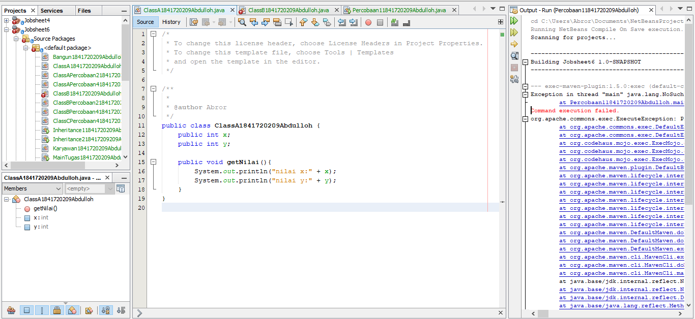

Link kode program : [ClassA1841720209Abdulloh.java](../../src/6_Inheritance/ClassA1841720209Abdulloh.java)

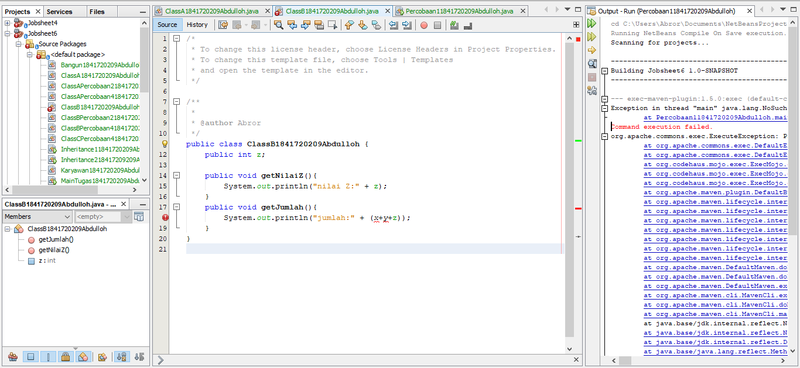

Link kode program : [ClassB1841720209Abdulloh.java](../../src/6_Inheritance/ClassB1841720209Abdulloh.java)

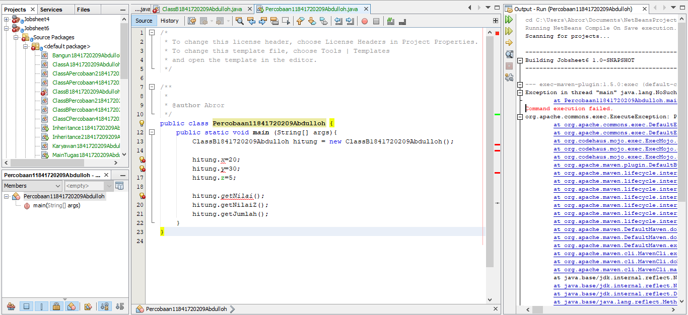

Link kode program : [Percobaan11841720209Abdulloh.java](../../src/6_Inheritance/Percobaan11841720209Abdulloh.java)

### Pertanyaan

1. Pada percobaan 1 diatas program yang dijalankan terjadi error, kemudian perbaiki sehingga program tersebut biasbisa dijalankan dan tidak error!

Jawab:

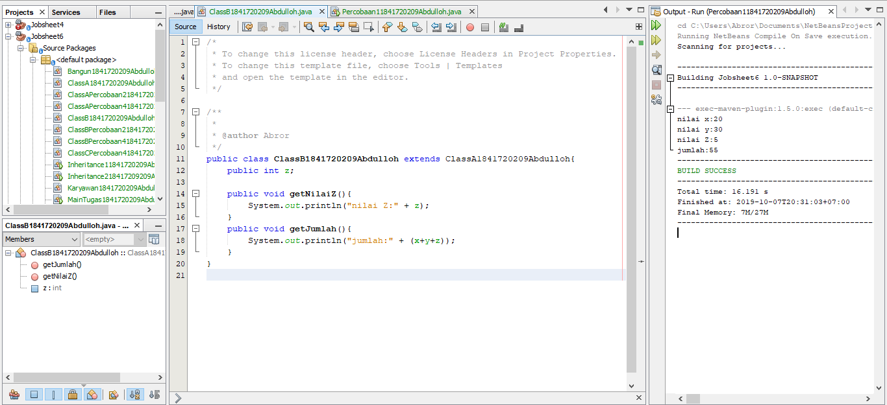

2. Jelaskan apa penyebab program pada percobaan 1 ketika dijalankan terdapat error!

Jawab :

Penyebabnya adalah ClassB tidak di beri “extends ClassA” sehingga terjadi error

### Percobaan 2

#### Class A,B, dan Main Percobaan 2

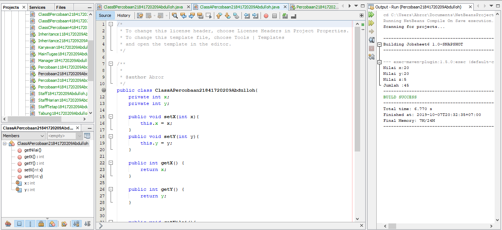

Link kode program : [ClassAPercobaan21841720209Abdulloh.java](../../src/6_Inheritance/ClassAPercobaan21841720209Abdulloh.java)

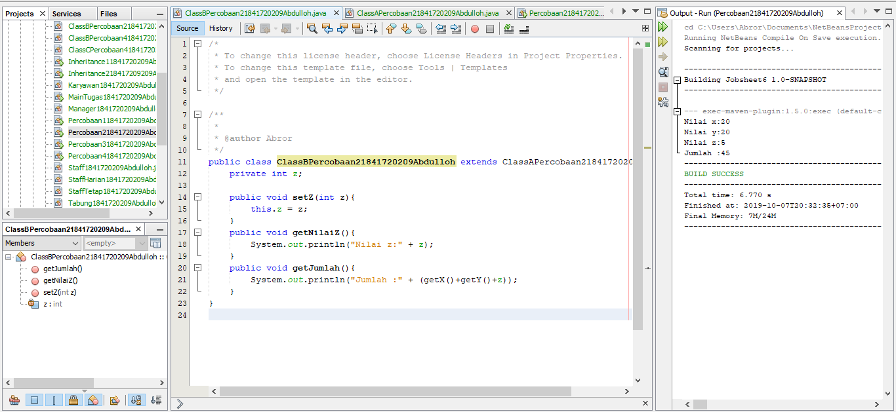

Link kode program : [ClassBPercobaan21841720209Abdulloh.java](../../src/6_Inheritance/ClassBPercobaan21841720209Abdulloh.java)

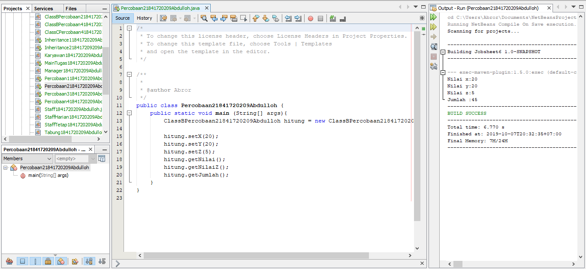

Link kode program : [Percobaan21841720209Abdulloh.java](../../src/6_Inheritance/Percobaan21841720209Abdulloh.java)

### Pertanyaan

1. Pada percobaan 2 diatas program yang dijalankan terjadi error, kemudian perbaiki sehingga program tersebut bisa dijalankan dan tidak error!

Jawab:

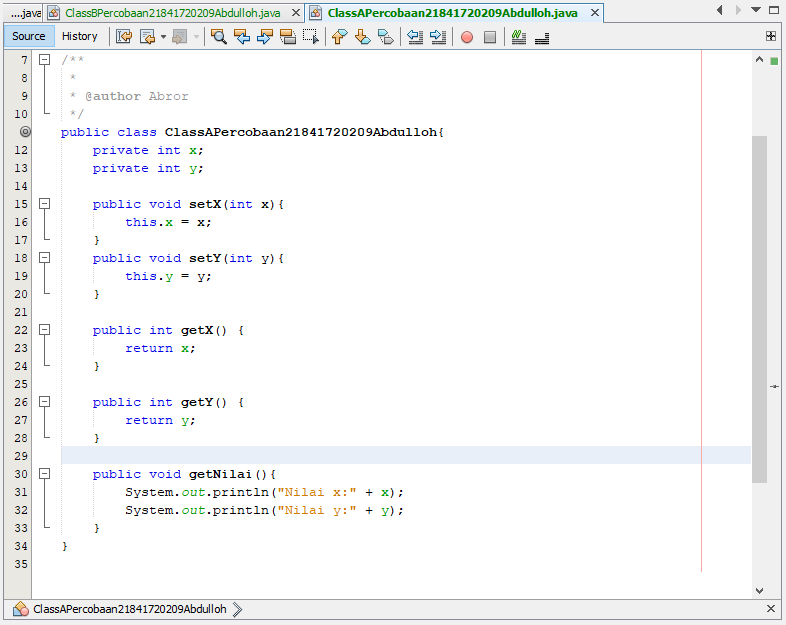

2. Jelaskan apa penyebab program pada percobaan 1 ketika dijalankan terdapat error!

Jawab :

Penyebabnya karena modifier sebelumnya private sehingga variable tidak dapat diakses oleh kelas lain

### Percobaan 3

#### Class Bangun, Tabung, dan Main Percobaan 3

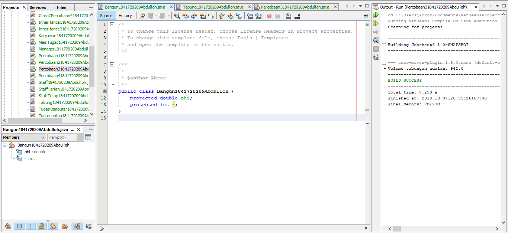

Link kode program : [Bangun1841720209Abdulloh.java](../../src/6_Inheritance/Bangun1841720209Abdulloh.java)

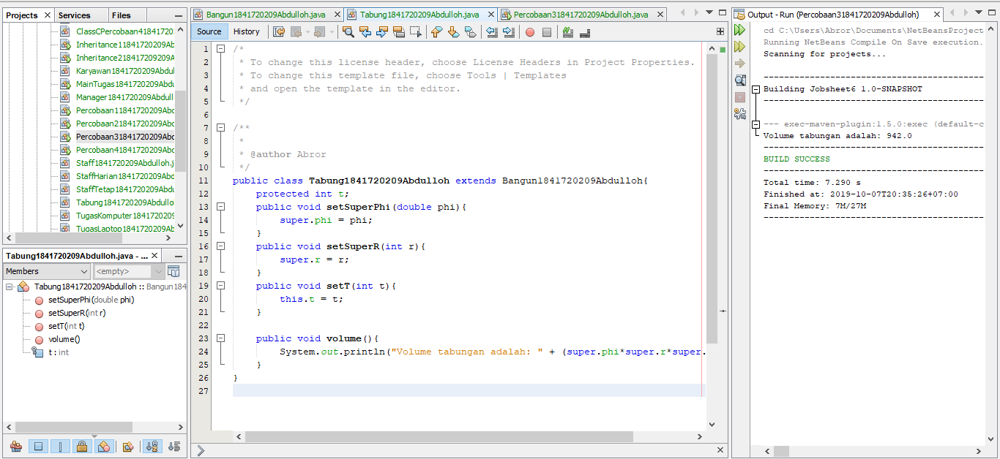

Link kode program : [Tabung1841720209Abdulloh.java](../../src/6_Inheritance/Tabung1841720209Abdulloh.java)

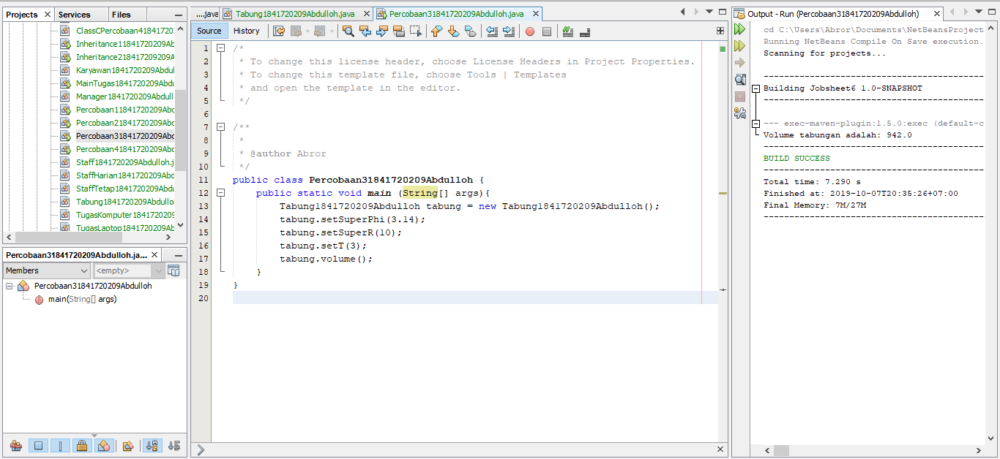

Link kode program : [Percobaan31841720209Abdulloh.java](../../src/6_Inheritance/Percobaan31841720209Abdulloh.java)

### Pertanyaan

1. Jelaskan fungsi “super” pada potongan program berikut di class Tabung!

Jawab:

Fungsi Super adalah digunakan untuk merepresentasikan objek dari class induk.

2. Jelaskan fungsi “super” dan “this” pada potongan program berikut di class Tabung!

Jawab :

Super phi dan r berasal dari class induk maka harus direpresentasikan dengan super. Sedangkan T berasal dari kelas yang sama maka direpresentasikan dengan this.

3. Jelaskan mengapa pada class Tabung tidak dideklarasikan atribut “phi” dan “r” tetapi class tersebut dapat mengakses atribut tersebut.

Jawab :

Tentu tidak bisa ditambahkan karena ditambahkan “extends Bangun” pada class Tabung

### Percobaan 4

#### Class A, B, C, dan Main Percobaan 4

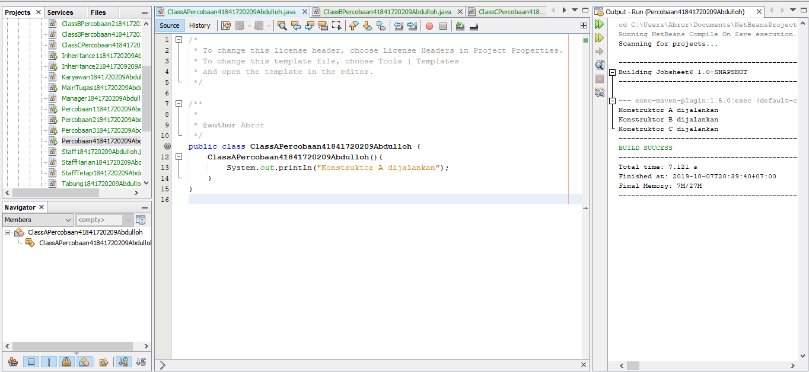

Link kode program : [ClassAPercobaan41841720209Abdulloh.java](../../src/6_Inheritance/ClassAPercobaan41841720209Abdulloh.java)

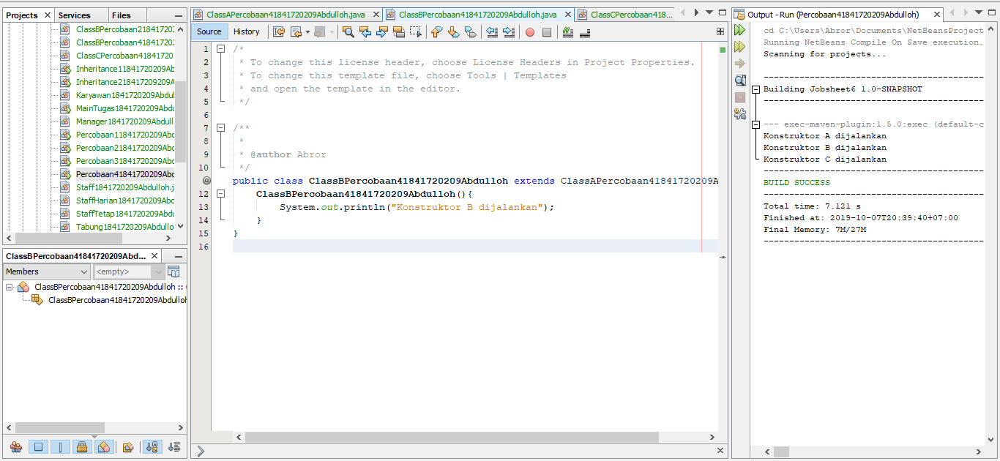

Link kode program : [ClassBPercobaan41841720209Abdulloh.java](../../src/6_Inheritance/ClassBPercobaan41841720209Abdulloh.java)

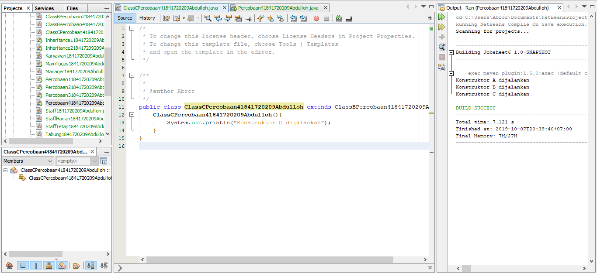

Link kode program : [ClassCPercobaan41841720209Abdulloh.java](../../src/6_Inheritance/ClassCPercobaan41841720209Abdulloh.java)

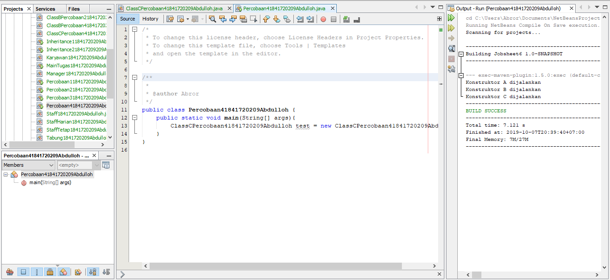

Link kode program : [Percobaan41841720209Abdulloh.java](../../src/6_Inheritance/Percobaan41841720209Abdulloh.java)

### Pertanyaan

1. Pada percobaan 4 sebutkan mana class yang termasuk superclass dan subclass, kemudian jelaskan alasannya!

Jawab :

Yang merupakan super class yaitu ClassA. ClassB dan ClassC termasuk subclass karena ClassB dan ClassC mewarisi ClassA

2. Ubahlah isi konstruktor default ClassC seperti berikut: Tambahkan kata super() di baris Pertaman dalam konstruktor defaultnya. Coba jalankan kembali class Percobaan4 dan terlihat tidak ada perbedaan dari hasil outputnya!

Jawab:

3. Ubahlah isi konstruktor default ClassC seperti berikut: Ketika mengubah posisi super() dibaris kedua dalam kontruktor defaultnya dan terlihat ada error. Kemudian kembalikan super() kebaris pertama seperti sebelumnya, maka errornya akan hilang. Perhatikan hasil keluaran ketika class Percobaan4 dijalankan. Kenapa bisa tampil output seperti berikut pada saat instansiasi objek test dari class ClassC : Jelaskan bagaimana urutan proses jalannya konstruktor saat objek test dibuat!

Jawab :

Pertama program membaca konstruktor ClassA, kemudian lanjut ke konstruktor ClassB yang di extends dengan ClassA, selanjutnya lanjut ke ClassC yang di extends ClassB, maka ketiga class tersebut dapat terhubung secara urut

4. Apakah fungsi super() pada potongan program dibawah ini di ClassC!

Jawab :

Fungai super() adalah Untuk memanggil konstruktor parent class, karena tidak ada yang dirujuk maka output tidak berpengaruh

### Percobaan 5

#### Class Karyawan, Manager, Staff, dan Mainnya yaitu Inheritance 1

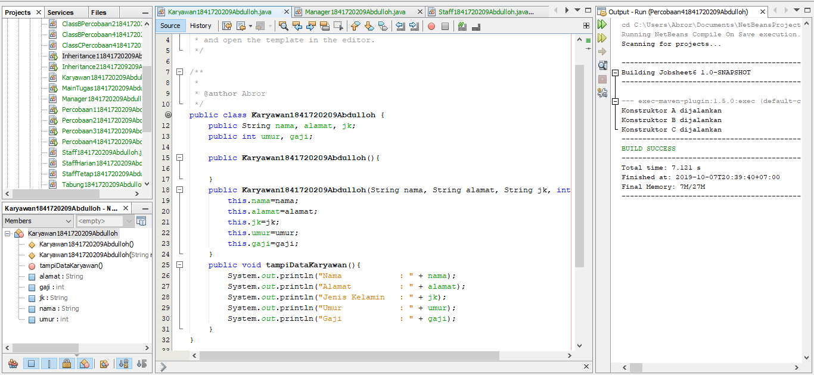

Link kode program : [Karyawan1841720209Abdulloh.java](../../src/6_Inheritance/Karyawan1841720209Abdulloh.java)

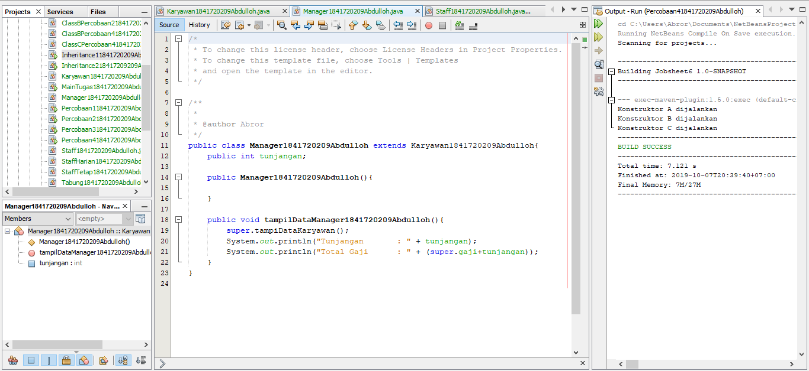

Link kode program : [Manager1841720209Abdulloh.java](../../src/6_Inheritance/Manager1841720209Abdulloh.java)

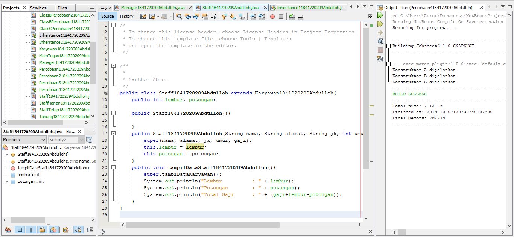

Link kode program : [Staff1841720209Abdulloh.java](../../src/6_Inheritance/Staff1841720209Abdulloh.java)

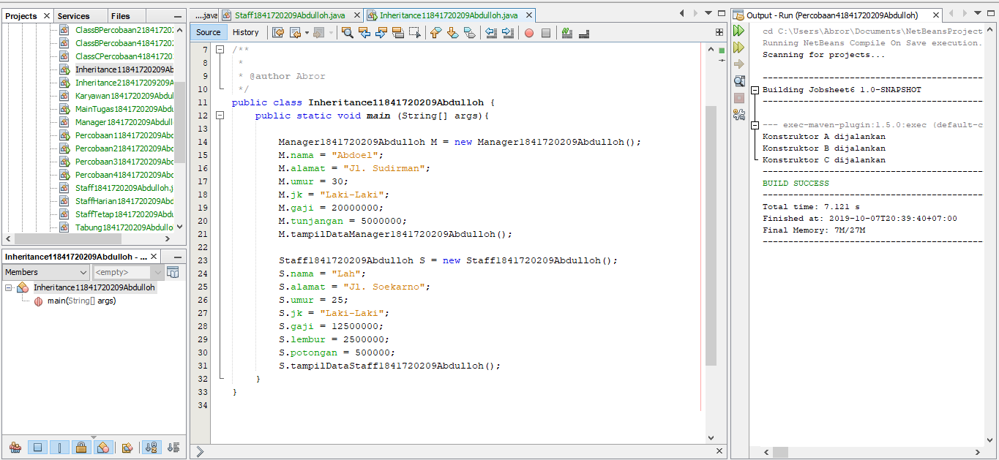

Link kode program : [Inheritance11841720209Abdulloh.java](../../src/6_Inheritance/Inheritance11841720209Abdulloh.java)

### Pertanyaan

1. Sebutkan class mana yang termasuk super class dan sub class dari percobaan 1 diatas!

Jawab :

Class Kaaryawan merupakan superclass, class Manager dan Staff merupaka subclass

2. Kata kunci apakah yang digunakan untuk menurunkan suatu class ke class yang lain?

Jawab :

Kata kuncinya ialah Extends

3. Perhatikan kode program pada class Manager, atribut apa saja yang dimiliki oleh class tersebut? Sebutkan atribut mana saja yang diwarisi dari class Karyawan!

Jawab :

Class Manager hanya memiliki atribut tunjangan, sedangkan yang diwarisi oleh class Manager yaitu : nama, alamat, jk, umur dan gaji

4. Jelaskan kata kunci super pada potongan program dibawah ini yang terdapat pada class Manager!

Jawab :

Untuk memanggil atribut gaji di class Karyawan

5. Program pada percobaan 1 diatas termasuk dalam jenis inheritance apa? Jelaskan alasannya!

Jawab :

Program tersebut termasuk Single Inheritance karena subclass hanya memiliki 1 parents

### Percobaan 6

#### Class Staff Harian, Staff Tetap, dan Mainnya yaitu Inheritance 2

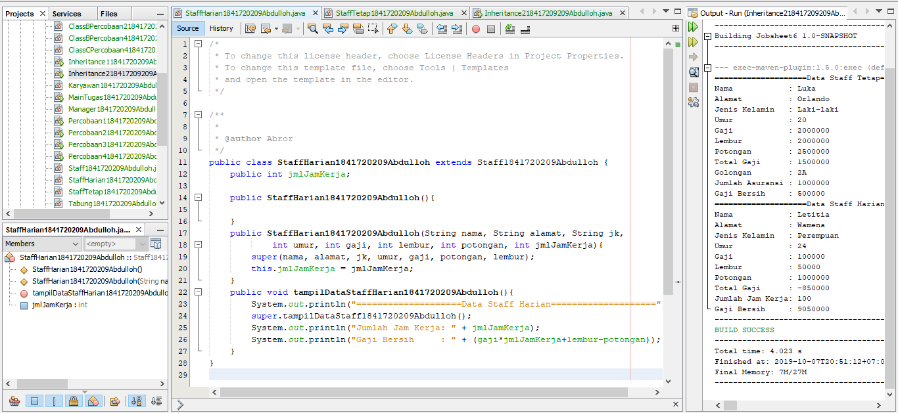

Link kode program : [StaffHarian1841720209Abdulloh.java](../../src/6_Inheritance/StaffHarian1841720209Abdulloh.java)

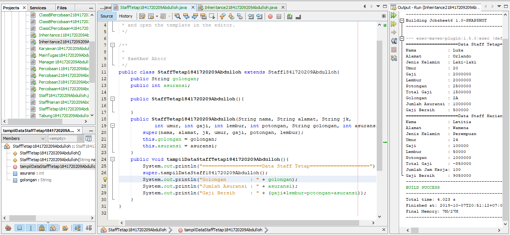

Link kode program : [StaffTetap1841720209Abdulloh.java](../../src/6_Inheritance/StaffTetap1841720209Abdulloh.java)

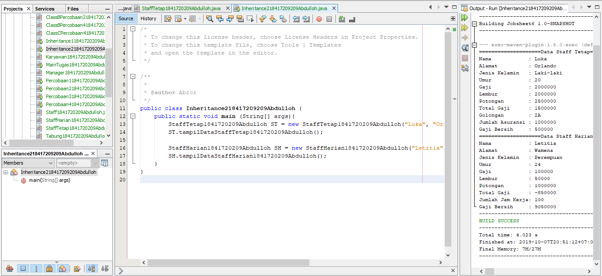

Link kode program : [Inheritance218417209209Abdulloh.java](../../src/6_Inheritance/Inheritance218417209209Abdulloh.java)

### Pertanyaan

1. Berdasarkan class diatas manakah yang termasuk single inheritance dan mana yang termasuk multilevel inheritance?

Jawab :

Yang Single inheritance adalah Staff dan Manager sedakngkan yang multilevel inheritance Staff Tetap dan Staffharian

2. Perhatikan kode program class StaffTetap dan StaffHarian, atribut apa saja yang dimiliki oleh class tersebut? Sebutkan atribut mana saja yang diwarisi dari class Staff!

Jawab :

Atribut yang diwarisi dari Class ialah Staff tetap golongan dan asuransi, staff harian jumlah jam kerja

3. Apakah fungsi potongan program berikut pada class StaffHarian?

Jawab :

Fungsi dari program tersebut adalah Untuk memanggil atribut tersebut dari class induk

4. Apakah fungsi potongan program berikut pada class StaffHarian?

Jawab :

Untuk memanggil method tersebut dari class induk

5. Perhatikan kode program dibawah ini yang terdapat pada class StaffTetap Terlihat dipotongan program diatas atribut gaji, lembur dan potongan dapat diakses langsung. Kenapa hal ini bisa terjadi dan bagaimana class StaffTetap memiliki atribu gaji, lembur, dan potongan padahal dalam class tersebut tidak dideklarasikan atribut gaji, lembur, dan potongan?

Jawab :

Hal itu dapat terjadi karena sudah ditulis dalam parameter konstruktor class tersebut

## Tugas

Buatlah sebuah program dengan konsep pewarisan seperti pada class diagram berikut ini. Kemudian buatlah instansiasi objek untuk menampilkan data pada class Mac, Windows dan 
Pc !

Jawab:

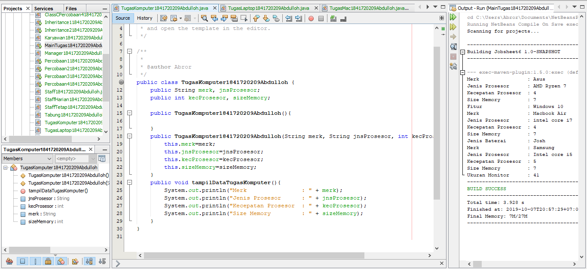

Link kode program : [TugasKomputer1841720209Abdulloh.java](../../src/6_Inheritance/TugasKomputer1841720209Abdulloh.java)

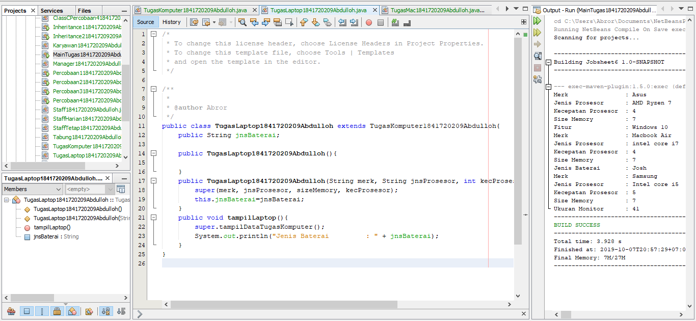

Link kode program : [TugasLaptop1841720209Abdulloh.java](../../src/6_Inheritance/TugasLaptop1841720209Abdulloh.java)

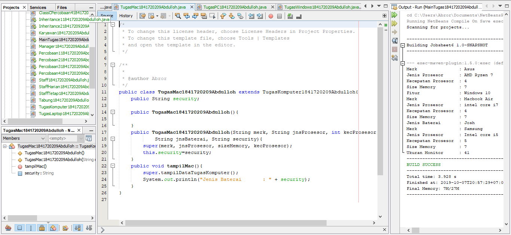

Link kode program : [TugasMac1841720209Abdulloh.java](../../src/6_Inheritance/TugasMac1841720209Abdulloh.java)

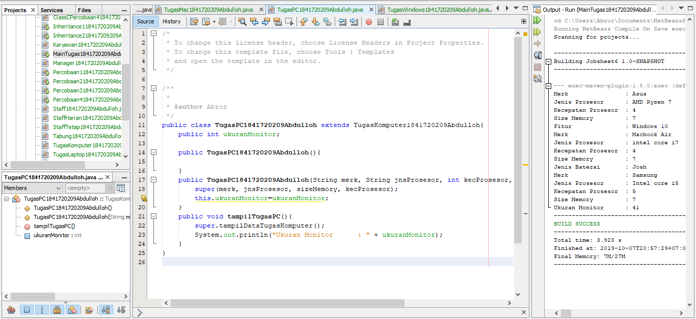

Link kode program : [TugasPC1841720209Abdulloh.java](../../src/6_Inheritance/TugasPC1841720209Abdulloh.java)

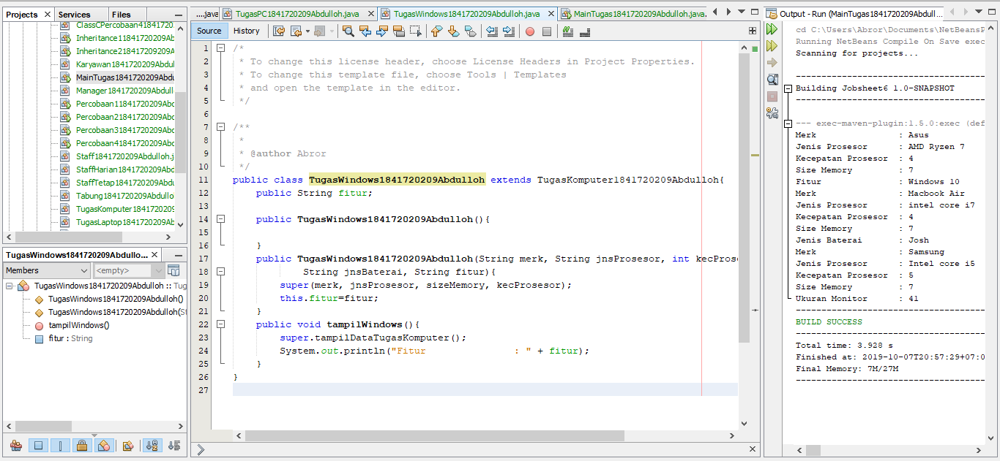

Link kode program : [TugasWindows1841720209Abdulloh.java](../../src/6_Inheritance/TugasWindows1841720209Abdulloh.java)

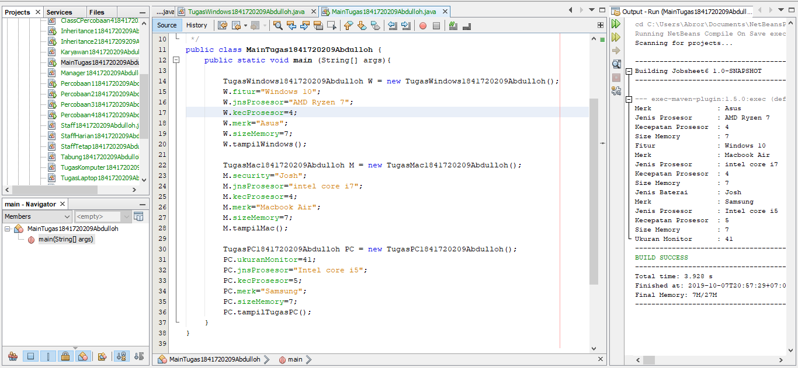

Link kode program : [MainTugas1841720209Abdulloh.java](../../src/6_Inheritance/MainTugas1841720209Abdulloh.java)

## Kesimpulan

Setelah belajar Inheritance kita memahami konsep dasar inheritance atau pewarisan, cara membuat suatu subclass dari suatu superclass tertentu, mengimplementasikan konsep single dan multilevel inheritance,cara membuat objek dari suatu subclass dan melakukan pengaksesan terhadap atribut 
dan method baik yang dimiliki sendiri atau turunan dari superclass nya. 

## Pernyataan Diri

Saya menyatakan isi tugas, kode program, dan laporan praktikum ini dibuat oleh saya sendiri. Saya tidak melakukan plagiasi, kecurangan, menyalin/menggandakan milik orang lain.

Jika saya melakukan plagiasi, kecurangan, atau melanggar hak kekayaan intelektual, saya siap untuk mendapat sanksi atau hukuman sesuai peraturan perundang-undangan yang berlaku.

Ttd,

Abdulloh