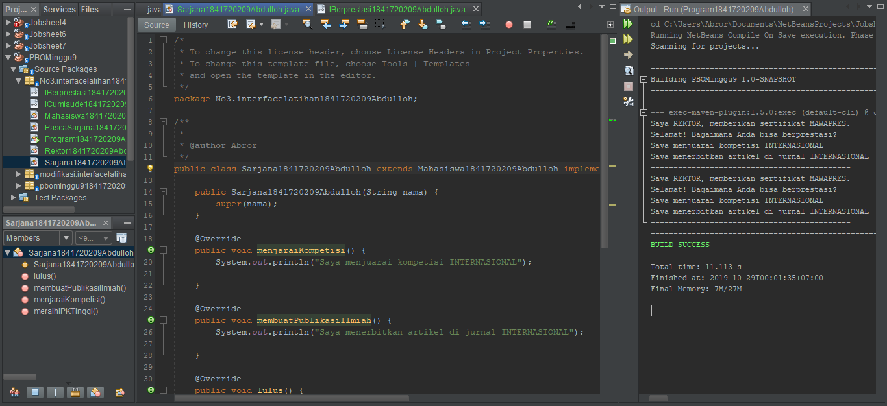

# Laporan Praktikum #9 - Abstract Class dan Interface

## Kompetensi

Setelah menyelesaikan lembar kerja ini mahasiswa diharapkan mampu:
1. Menjelaskan maksud dan tujuan penggunaan Abstract Class;
2. Menjelaskan maksud dan tujuan penggunaan Interface;
3. Menerapkan Abstract Class dan Interface di dalam pembuatan program.

## Praktikum 1

#### Class Hewan, Kucing, Ikan, Orang, Program

Penjelasan : Di dalam praktikum yang pertama ini kita belajar akan pengimplementasikan abstract yang meng-extend suatu class dan di override

Link kode program : [Link_Hewan](../../src/9_Abstract_Class_dan_Interface/Hewan1841720209Abdulloh.java)

Link kode program : [Link_Kucing](../../src/9_Abstract_Class_dan_Interface/Kucing1841720209Abdulloh.java)

Link kode program : [Link_Ikan](../../src/9_Abstract_Class_dan_Interface/Ikan1841720209Abdulloh.java)

Link kode program : [Link_Orang](../../src/9_Abstract_Class_dan_Interface/Orang1841720209Abdulloh.java)

Link kode program : [Link_Program](../../src/9_Abstract_Class_dan_Interface/Program1841720209Abdulloh.java)

## Pertanyaan Percobaan 1

1. Bolehkah apabila sebuah class yang meng-extend suatu abstract class tidak mengimplementasikan method abstract yang ada di class induknya? Buktikan!

Jawab:

Tidak boleh, dan tidak bisa

## Praktikum 2

#### Class ICumlaude, Mahasiswa, Sarjana, PascaSarjana, Rektor, Program

Penjelasan : Di dalam praktikum ini kita belajar cara membuat kode interface yang benar dan pemngimplentasiannya

Link kode program : [Link_ICumlaude](../../src/9_Abstract_Class_dan_Interface/ICumlaude1841720209Abdulloh.java)

Link kode program : [Link_Mahasiswa](../../src/9_Abstract_Class_dan_Interface/Mahasiswa1841720209Abdulloh.java)

Link kode program : [Link_Sarjana](../../src/9_Abstract_Class_dan_Interface/Sarjana1841720209Abdulloh.java)

Link kode program : [Link_PascaSarjana](../../src/9_Abstract_Class_dan_Interface/PascaSarjana1841720209Abdulloh.java)

Link kode program : [Link_Rektor](../../src/9_Abstract_Class_dan_Interface/Rektor1841720209Abdulloh.java)

Link kode program : [Link_Program](../../src/9_Abstract_Class_dan_Interface/Program21841720209Abdulloh.java)

## Pertanyaan Percobaan 2

1. Mengapa pada langkah nomor 9 terjadi error? Jelaskan!

Jawab:

> Karena pada class mahasiswa, dia tidak mengimplementasikan class Inteface ICumlaude, sehingga tidak bisa memanggil apapun yang bertipe mahasiswa yang tidak memiliki hubungan apapun dengan class ICumlaude 

2. Dapatkah method kuliahDiKampus() dipanggil dari objek sarjanaCumlaude di class Program? Mengapa demikian?

Jawab:

> Method di kuliahDiKampus() bisa dipanggil dari sarjanaCumlaude

3. Dapatkah method kuliahDiKampus() dipanggil dari parameter mahasiswa di method beriSertifikatCumlaude() pada class Rektor? Mengapa demikian?

Jawab:

> Tidak Bisa Karena method tidak mengambalikan nilai yang bisa di simpan dalam bentuk objek ICumlaude

4. Modifikasilah method beriSertifikatCumlaude() pada class Rektor agar hasil eksekusi class Program menjadi seperti berikut ini:

>

>

## Praktikum 3

#### Class ICumlaude, IBerprestasi, Mahasiswa, Sarjana, PascaSarjana, Rektor, Program

Penjelasan : Di dalam praktikum ini kita belajar cara membuat kode interface yang benar dan pemngimplentasian multi value

Link kode program : [Link_IBerprestasi](../../src/9_Abstract_Class_dan_Interface/IBerprestasi1841720209Abdulloh.java)

Link kode program : [Link_ICumlaude](../../src/9_Abstract_Class_dan_Interface/ICumlaude1841720209Abdulloh2.java)

Link kode program : [Link_Mahasiswa](../../src/9_Abstract_Class_dan_Interface/Mahasiswa1841720209Abdulloh2.java)

Link kode program : [Link_Sarjana](../../src/9_Abstract_Class_dan_Interface/Sarjana1841720209Abdulloh2.java)

Link kode program : [Link_PascaSarjana](../../src/9_Abstract_Class_dan_Interface/PascaSarjana21841720209Abdulloh.java)

Link kode program : [Link_Rektor](../../src/9_Abstract_Class_dan_Interface/Rektor1841720209Abdulloh2.java)

Link kode program : [Link_Program](../../src/9_Abstract_Class_dan_Interface/Program31841720209Abdulloh.java)

## Pertanyaan Percobaan 3

1. Apabila Sarjana Berprestasi harus menjuarai kompetisi NASIONAL dan menerbitkan artikel di jurnal NASIONAL, maka modifikasilah class-class yang terkait pada aplikasi Anda agar di class Program objek pakRektor dapat memberikan sertifikat mawapres pada objek sarjanaCumlaude.

## Kesimpulan

* Perkenalan dan percobaan Abstract dan Interface
* Mengerti lebih tentang implmentasi

## Pernyataan Diri

Saya menyatakan isi tugas, kode program, dan laporan praktikum ini dibuat oleh saya sendiri. Saya tidak melakukan plagiasi, kecurangan, menyalin/menggandakan milik orang lain.

Jika saya melakukan plagiasi, kecurangan, atau melanggar hak kekayaan intelektual, saya siap untuk mendapat sanksi atau hukuman sesuai peraturan perundang-undangan yang berlaku.

Ttd,

***(Abdulloh)***